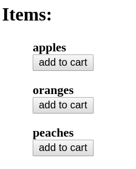

# React - Objects And Arrays

## Resources

* [Spread Operator - mdn](https://developer.mozilla.org/en-US/docs/Web/JavaScript/Reference/Operators/Spread_operator)
* [Proposal object spread - Ecma TC39](https://github.com/tc39/proposal-object-rest-spread)
* [Object Rest Spread Transform - Babel](https://babeljs.io/docs/plugins/transform-object-rest-spread/)

## Lesson

The true power of react lies in its ability to leverage javascript. So far we have been dealing mostly with primitive values: string and numbers. The real magic begins to happen when we introduce objects and arrays into the React world.

### [Fruit Shop](https://codesandbox.io/s/jp7z2oolrw)

Say that we want to create an item list and shopping cart for a simple fruit shop. The shop has three items: apples, oranges and peaches. We will start with assigning each item to an object with a name and an id. Note that each id corresponds to the index of the item in the array. We will also create a `cart` part of state set to an empty array:

```js
class FruitShop extends Component {
  constructor() {
    super();

    this.state = {
      items: [
        { id: 0, name: "apples" },
        { id: 1, name: "oranges" },
        { id: 2, name: "peaches" }
      ],
      cart: []
    };
  }
  ...
```

### `FruitItem.js`

First, we want to render each item on a separate line, along with an `add to cart` button. We will start by creating a functional component called `FruitItem` that will represent a single item to display:

```jsx
const FruitItem = props => {
  const { id, name, handleClick } = props;
  return (
    <div>
      <div>
        <strong>{name}</strong>
      </div>
      <button onClick={() => handleClick(id)}> add to cart </button>
    </div>
  );
};
```

We expect each item to take three arguments as `props`: the name and id from the array (one and two), an a `handleClick` function (three). Remember that we cannot simply write `{handleClick(id)}` because this will call the function immediately and return whatever that function returns.

Now let's return to the `FruitShop` component and begin writing the `render` function:

```jsx
  render() {
    const { items, cart } = this.state;

    return (
      <div>
        <h2> Items: </h2>
        <ul style={ulStyle}>
          {items.map(item => (
            <li style={liStyle}>
              <Item
                id={item.id}
                name={item.name}
                handleClick={this.handleClick}
              />
            </li>
          ))}
        </ul>
      ...
```

Above we are mapping each element in the `items` array to an `Item` component, passing the id, name, hand `handleClick` function. We will now have the rendered list of items:



Now let's turn to the `handleClick` function, where most of the heavy lifting happens. As we've seen before, the `handleClick` function takes the item id as an argument. It will then need to check if an item with that id is already in the cart: if it is, the quantity of the item in the cart will be increased. If it isn't, we'll add a new element to the cart with the item's `name`, `id`, and a quantity of `1`.

First, we will take the `cart` from `state` and make a copy of it. In React we will try to avoid modifying the existing state, for reasons that will become clear later on.

```jsx
handleClick = id => {
    const { cart } = this.state;
    // copying the cart array to a new variable
    const newCart = cart.slice(0);
    ...
```

Next, we will check if an item with the given `id` is already in the cart:

```jsx
    // Trying to find index in cart
    const index = cart.findIndex(item => item.id === id);
```

The `findIndex` function will return either the index of the found item or `-1` if the item was not found. Next, we will deal with the case that the item was not found:

```jsx
    if (index === -1) {
      // adding item to cart with quantity of 1
      // Using the object spread operator
      newCart.push({ ...items[id], quantity: 1 });
    } else {
    ...
```

Since each `id` corresponds to the index of the item in `this.items`, we can easily access it. Note that we are using the object spread operator above: `...items[id]`. This will copy into the new object all the properties from the corresponding object at `items[id]`. For example, if the `id` is `1`, then the element at `items[1]` is   `{ id: 1, name: "oranges" }`, and the object pushed into the cart will be `{ id: 1, name: "oranges", quantity: 1}`.

Now we will handle the other case, when the item is in the cart. We have already found the index before, so all we have to do is increase the quantity of at that index.

```js
    ...
    } else {
      // adding 1 to item quantity
      newCart[index].quantity += 1;
    }
```

Finally, we will call `setState` with the new cart:

```js
    this.setState({
      cart: newCart
    });
  };
```

And the heavy lifting is done.

#### Showing the cart

The last piece of our app is showing the cart items. We will first define a `CartItem` component:

```jsx
const CartItem = props => {
  const { name, quantity } = props;
  return (
    <div>
      <div> {name} </div>
      <div> {quantity} lbs </div>
    </div>
  );
};
```

Now, in the `App` component's `render` function, we will map each element from `cart` to a `CartItem` component:

```jsx
    ...
    <h2> Cart: </h2>
      <ul}>
        {cart.map(item => (
          <li>
            <CartItem name={item.name} quantity={item.quantity} />
          </li>
        ))}
      </ul>
    ...
```

And for now, our app is done. Of course, there is lots of additional functionality we could introduce (prices, removing items from the cart, etc.). However, if you are able to understand all the moving parts of the current app, you are quite close to becoming proficient in React.
