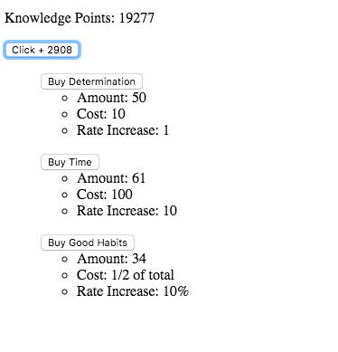

# Clicker Game

Today, we're going to expand on our counting app example to create a [clicker game](https://en.wikipedia.org/wiki/Incremental_game). Unlike [Cookie Clicker](http://orteil.dashnet.org/cookieclicker/), Adventure Capitalist, or other classics of the genre, our game will not require the inclusion of any idle elements (in other words, don't worry about `setTimeout` just yet).

We will be making a game called Knowledge Clicker. This game will have the following elements:

* Knowledge Points, which you earn by repeatedly clicking on a button.
* Power-ups, which you can buy with Knowledge Points, which increase the effectiveness of each click in some way.

While this is an un-styled, sort of bare-bones version of the final product, at the end of the day, your project should end up looking something like this:

This example, however, would constitute an acceptable implementation of this project. **Please make sure you complete the steps to create this before styling/adding extra features.**

Go ahead and open up an empty Codesandbox project and let's get started.

## Step 1: Setup

So, we'd like to have two files here: `index`, which will simply render our `Clicker` component in React's DOM, and `Clicker`, which will contain our game logic.

In your `Clicker` component, let's start by just cloning the Counter app from class. Make a part of state called `points` (or `knowledgePoints`, if you like), render that count to the page, and then render a button underneath it that increases `points` by one for each click.

*Hint: You'll probably have to make a function, and you'll want to make use of a couple methods: `onClick` and `setState`.*

## Step 2: Let's Plan

Next, we have to think about how our power-ups are going to work. Because this is a game about gaining knowledge, let's start with a classic trait that helps students learn difficult material: **determination**. Determination will cost 10 Knowledge Points and it will increase the effect of each click by one.

For example, let's say I had 20 Knowledge Points. If I buy 1 Determination, my Knowledge Point total goes down to 10, but each click now increases my point total by 2. If I buy one more, I now have 0 Knowledge Points, but the rate that each click increases my Knowledge Points goes up to 3, and so on.

Okay. So we're talking about two concepts: *amount* (e.g. the number of points we have) and *rate* (the point increase per click). Amount is easy to calculate - we have a part of state that keeps track of it already.

Rate is trickier. We could hold a part of state called `rate` that would increase each time we power up. However, if we're keeping track of our power-ups (like Determination) in state, and our power-ups influence our rate, we are holding redundant information in state - which we don't particularly like.

However, because we aren't sure how our other power-ups are going to affect our rate, and because we may want to store it to communicate it to our users, let's make a part of state called `rate` for now.

**These kinds of decisions happen all the time in React**. There's no right or wrong answer here, necessarily. We're just doing the best we can with the information we have, and trying to keep things flexible for the future.

## Step 3: Do It The Easy Way First

Alright. Let's make another button to let the user buy Determination. Let's also make a `determination` part of state, and a corresponding method (`buyDetermination`) to increase determination, which we'll attach to that button.

We'd like Determination to increase the rate our `points` part of state increases with each click. Therefore, our `buyDetermination` function should change three parts of state: It should decrease our `points` by 10 (the cost of one point of Determination), it should increase our `determination` by 1, *and* it should increase our `rate` by 1.

**Challenge: Knowledge Points can't go below 0. Make sure that `buyDetermination` can't be triggered if the user's `points` part of state is below 10.**

Play around with this to make sure it works. You should be able to increase your Knowledge Points at a much faster rate once you start buying a few Determination points.

### Step 3.5: Displaying Info to the User

Make sure that the user understands everything about Determination. They should be able to see how much they have, how much it costs, and how much it increases their rate of Knowledge Points per click. You can see in our example that we're using `ul` and `li` tags to organize that information. We recommend that, but you can organize it however you'd like.

Users should also be aware of their rate of knowledge point accumulation. Make sure all of this is available to the user before proceeding to the next step.

## Step 4: More Powerups
