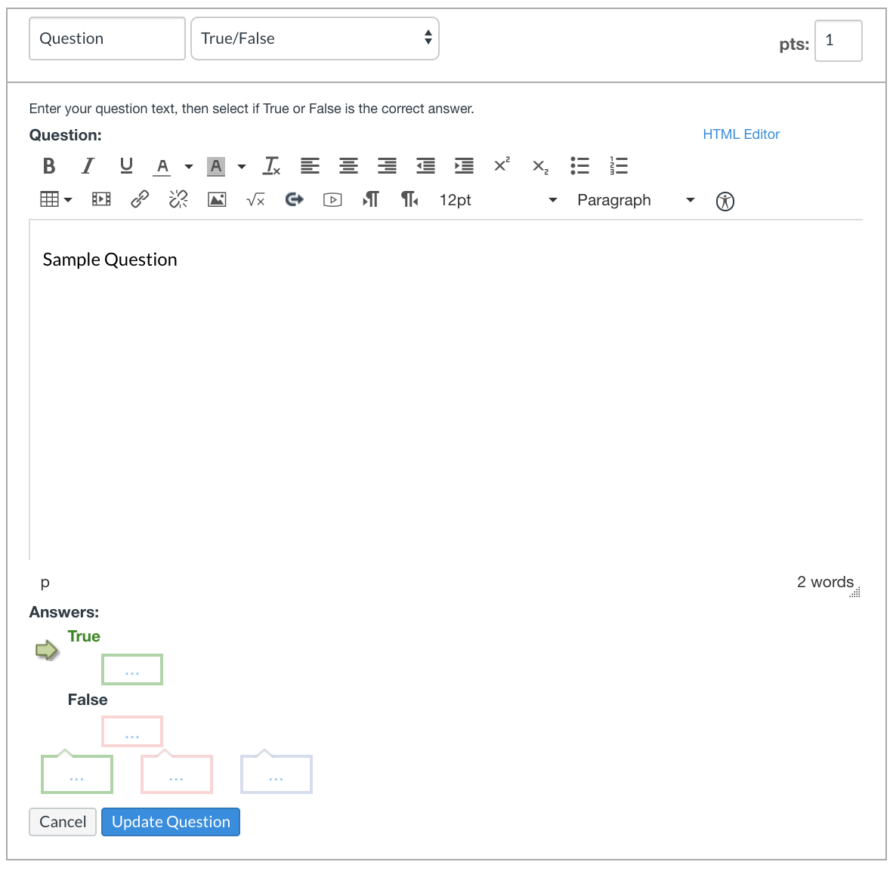

# Forms in React

## Objectives
- Use the `form` tag in a React app
- Create an `input` and `select` and update state accordingly

## Project Demo
 - [link](https://codesandbox.io/s/pedantic-shape-q2i7h)

# 1. Handling user input using the form tag

In previous lessons, we've handled user interaction by setting the `onclick` property of the button.  Many applications that involve user input require combining several inputs together within the same form:



In order to accomplish this, we will use the HTML `form` tag.

Why should we use a `form` tag instead of setting the `onclick` property of the submit button?  One main reason is **accessibility**.  Some users use a screen reader that translates the UI into audio.  In order for this to work effectively, websites should be designed using **semantic HTML**.  This means that your HTML tags should be as descriptive as possible to make it clear what their function is.

# 2. Building a form

Let's put together a form using the `form` tag:

To handle submission, we will use the `onSubmit` in property of the form:

`UserImportForm.js`
```js
import React from "react";

class UserInfoForm extends React.Component {
  render() {
    return (
      <form onSubmit={this.handleFormSubmit}>
        <h2>User Information</h2>
        <button>Submit</button>
      </form>
    );
  }

  handleFormSubmit = (event) => {
    event.preventDefault();
    alert("Form submitted!");
  };
}

export default UserInfoForm;
```

Note that we must call `event.preventDefault()` in our `handleFormSubmit` to avoid the page from being reloaded, which is the default behavior.

With the structure of our form built, we can now include other opportunities for user input.

# 3. Checkboxes

The first input we'll add is a checkbox.  As the box is checked, we want to update our state.  

```js
import React from "react";

class UserInfoForm extends React.Component {
  constructor() {
    super();
    this.state = {
      notARobot: false
    };
  }

  handleCheckboxChange = (event) => {
    this.setState({
      notARobot: event.target.checked
    });
  };

  handleFormSubmit = (event) => {
    event.preventDefault();
    alert("Form submitted!");
  };

  render() {
    const { notARobot } = this.state;
    return (
      <form onSubmit={this.handleFormSubmit}>
        <h2>User Information</h2>
        <label>I am not a robot
          <input 
            type='checkbox'
            checked={notARobot}
            onChange={this.handleCheckboxChange}
          />
        <label/>
        <p hidden={!notARobot}>Confirmed human!</p>
        <button>Submit</button>
      </form>
    );
  }
}

export default UserInfoForm;
```

The `onChange` property in the checkbox enables us to link a function to change events.  Our `handleCheckboxChange` function takes in one of these events, and reads from the `target`'s `checked` property to see whether or not the box is checked.  This enables us to avoid referring to a specific checkbox in our function's implementation.

In `handleCheckboxChange`, we update the state accordingly.  When the view re-renders, the "Confirmed human!" `p` tag's `hidden` property switches from `true` to `false`.

It is best to have inputs manipulate your state, rather than trying to keep the information coupled to your views.

# 4. Selects

We now add a `select` for the title (e.g Ms. or Dr.).  First, we need to add the property `title` to the state.  This represents the `value` property of the `option` tag.

```js
this.state = {
  notARobot: false,
  title: ""
};
```

Next, we add a function `handleSelectChange` that will update our state when the user selects a different option.

```js
handleSelectChange = (event) => {
  this.setState({
    title: event.target.value
  });
};
```

Finally, we can add a select inside of our `render()` method:

```js
<p>
  <select value={title} onChange={this.handleSelectChange}>
    <option value=''></option>
    <option value='mr'>Mr.</option>
    <option value='ms'>Ms.</option>
    <option value='mrs'>Mrs.</option>
    <option value='mx'>Mx.</option>
    <option value='dr'>Dr.</option>
  </select>
</p>
```


# 5. Text Inputs

We want now to add text inputs for the first name and the last name of the user.  First, we modify our state:

```js
this.state = {
  notARobot: false,
  title: "empty",
  firstName: "",
  lastName: ""
}
```

Then, we add methods to handle the text in the inputs changing:

```js
handleLastNameChange = (event) => {
  this.setState({lastName: event.target.value})
}
handleFirstNameChange = (event) => {
  this.setState({firstName: event.target.value})
}
```

And add our inputs to the `render` method:

```js
<input
  value={firstName}
  placeholder="First Name"
  onInput={this.handleFirstNameChange}
/>
<input
  value={lastName}
  placeholder="Last Name"
  onInput={this.handleLastNameChange}
/>
```

# 6. Handling submission

When the submit button is pressed, `handleFormSubmit` is called, and reads from the state to ensure that the form can be submitted.  In a future lesson, we'll see how to react to the state changing to ensure that the user isn't able submit the form until all fields are valid.

```js
handleFormSubmit = event => {
  event.preventDefault();
  if (this.allFieldsValid()) {
    alert("Form submitted!");
  } else {
    alert("Please complete the form");
  }
};
allFieldsValid = () => {
  return (
    this.state.notARobot &&
    this.state.title &&
    this.state.firstName &&
    this.state.lastName
  );
};
```
