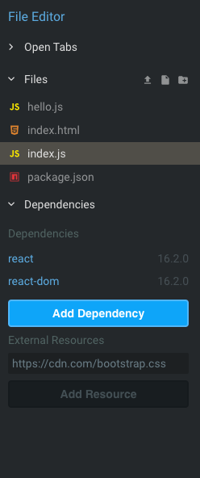

# React 1

## Sources

* [Why React?](https://reactjs.org/blog/2013/06/05/why-react.html)
* [React - Official Website](https://reactjs.org/)
* [The Virtual DOM](https://www.codecademy.com/articles/react-virtual-dom)
* [Rendering Elements - React Docs](https://reactjs.org/docs/rendering-elements.html)
* [React.Component - React Docs](https://reactjs.org/docs/react-component.html)
* [Introducing JSX](https://reactjs.org/docs/introducing-jsx.html)
* [CodeSandbox - An online code editor for React](https://codesandbox.io)

## Terms

* Virtual DOM
* Components
* React and React DOM
* `render`
* JSX

## Introduction

React is described as "a JavaScript library for building user interfaces." When you read that description, it probably doesn't mean much. Here's the real takeaway: Once you learn React, you'll never want to go back to the DOM. It's a convenient, well-maintained frontend framework for making websites - websites as simple as the little apps we'll make today, and as complicated as Facebook.

## Why Not the DOM?

Thus far, your frontend learning has consisted largely of **DOM manipulation**. This is nice to learn, because not only is it the foundation of how JavaScript and HTML/CSS work together on the Internet, there's a pretty clear 1:1 relationship between HTML elements, DOM nodes, and your JavaScript code.

React works a bit differently. We include an HTML file in our React apps, but it isn't doing much - it contains a single `div` element, usually with the id `root`. We use React to *render our entire app* inside this element.

But, wait. How can we hold a whole app inside a single HTML element? Well, React assembles an entire app - HTML and all - and eventually, inserts it into the element. In order to update the page, it doesn't over-utilize DOM manipulation, which is relatively inefficient. Instead, it creates a **virtual DOM** which renders and updates elements before it inserts them inside the root element in our HTML page.

It's not too important to know how this works - just know that React looks different, but at the core, it's still manipulating the DOM. It's an interface for us, as programmers, to more efficiently do that stuff.

## From Classes To Components

In React, we define classes, but we do not need to create instances of them (i.e. no use of `new`). React will create instances of our classes automatically without our prompting. It knows how to do this, partially, because of *class inheritance*.

When we create a class in React, usually, we add `extends React.Component` to tell it to inherit from React's Component class. Because React is an NPM module, we can't see this Component class unless we poke around in our `node_modules` folder. However, having our React classes inherit from the Component class lets us do a ton of cool stuff. In fact, we usually don't refer to React classes as classes - we refer to them as **components**.

Components are the basic building blocks of React websites. We use components for a lot of different things. Components can store information on the frontend and render it to the user. They can accept user input and fire AJAX requests to APIs. **Very little happens in React without a component making it happen**. Learning how to structure and delegate responsibilities between components is one of the most important things we can do as frontend developers.

Initially, we're going to be making React apps that consist of a single component. This is so that we can get familiar with how React looks and works. However, please keep in mind that most React apps consist of **dozens** of components, each performing different functions and working together to render a complete, seamless web app to our users.

### The Code Sandbox

For the time being, we will be using an online code editor for React called [Code Sandbox](https://codesandbox.io/). We're going to learn how to set up React locally soon, but for the time being, Code Sandbox is really convenient. To save your work, you will need to sign in with Github.

The files for the current project are available in the menu to the left. These may also available as tabs, although the tabs may be closed. To keep a tab open, click on a file from the left-side menu and then press `<ctrl> + <s>`.

## [Our First React Example](https://codesandbox.io/s/k3wxk25km7)

So. Let's get acquainted here.



### package.json

We've got four files in this project. First is our old friend `package.json`, which lets us know that we're importing two NPM dependencies: `react-dom` and `react`. More on the difference between these packages soon.

### index.html

Next, let's look at our `index.html` file. The body of the file, as you can see, is pretty sparse:

```html
<body>
	<div id="root"></div>
</body>
```

In fact, it's empty. An empty `div` with an `id` attribute of "root". If all we have is an empty `div`, you might ask, how will this app render anything to the user?

JavaScript, React, and the virtual DOM to the rescue!

### index.js

Let's take a look at this eight-line file:

```js
const React = require("react");
const ReactDom = require("react-dom");
import Hello from './hello.js';

ReactDom.render(
  <Hello />,
  document.getElementById("root")
);
```

So, first we're importing three things: `react` and `react-dom`, our two NPM modules, and something called `Hello`, which, because it's capitalized, we suspect is an ES6 class.

Then we call a function from our `react-dom` module called `render`. This function takes two arguments: Something that looks like a weird combination of JavaScript and HTML (`<Hello />`), and a DOM node, referring to the "root" div in our HTML file.

This points to the difference between the React and React DOM libraries. React contains all the good virtual DOM stuff we need to get our components to assemble and function. React DOM actually interacts with the DOM to render our components on the page.

`Hello` refers to a React component called `Hello`. So in this case, what `render` is doing is inserting the `Hello` component inside the `root` div in our HTML.

But what does the `Hello` component look like? Well, let's take a look:

### hello.js

Let's see what ES6 class syntax does for us in this app:

```js
import React from 'react';

class Hello extends React.Component {
  constructor() {
    super();
  };

  render() {
    return(
      <p>hello world!</p>
    )
  }
};

export default Hello;
```

So, we create our `Hello` class, extending `React.Component` (which we get by importing React on line 1) to let our app know that we're defining the behavior for a component.

Our constructor, at this point, isn't particularly useful, but we have it there just in case we need it, and we're sure to include `super()` so that we have the full capabilities that React's Component class gives us.

For example, we have this method called `render` that React makes available to us. `render` is true to its name - the return value of `render` is what our component actually shows to the user.

`render` has a few rules and quirks, which we'll review now:

* **`render` returns JSX**
  - JSX is a React-specific templating language. Think of it as a cross between JavaScript and HTML. It allows us to do lots of interesting things, like use curly braces to insert JS directly into our HTML. More on this stuff later!
* **`render` has to return one JSX element**
  - If you want to return multiple elements, just wrap it in a containing tag - React will read that as one element. It has to return JSX, but feel free to put some regular old JavaScript logic above the `return` statement if you need to.
* **`render` is only called under specific conditions**
	- Essentially, your page still isn't dynamic yet. We'll learn how to call `render` to "re-render" (update) the page soon.
* **Because of the virtual DOM, `render` as a React component method is different from `render` as a React DOM method - although they are connected**
  - Remember in `index.js` when we called `ReactDom.render` to insert our React app into our HTML page? Well, that's not quite what we're doing here. We are putting together JSX so that we can *eventually* insert it into our HTML page, but we are doing it in a much more granular way, just for the component that we're in. It's a matter of the virtual DOM (React) versus the actual DOM (ReactDom). Think of React's `render` as painting an artwork and `ReactDom.render` as sending it to a gallery.

## Conclusion

We've managed to render 'hello world!' in the browser using React! We've learned about the virtual DOM, basic React file structure, and the essential functions that React uses to render in the browser.

Tune in text time for event handling and updating the page!
