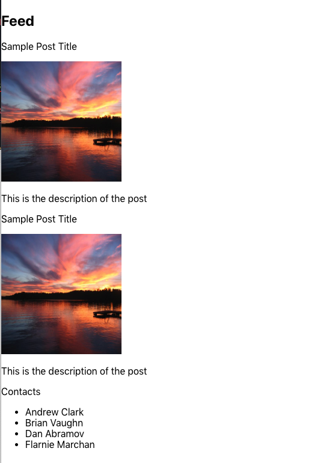
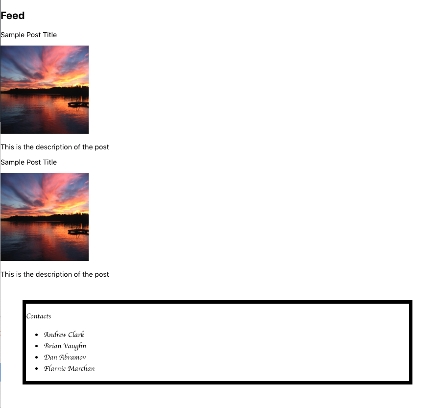
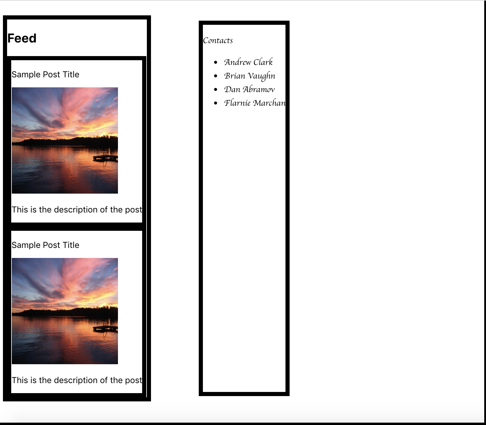

# Introduction to React

## Objectives

- Understand what React is and what problem it solves
- Create an application that uses React to render its front-end

## Readings

* [Why React?](https://reactjs.org/blog/2013/06/05/why-react.html)
* [React - Official Website](https://reactjs.org/)
* [W3Schools Introduction](https://www.w3schools.com/react/)
* [The Virtual DOM](https://www.codecademy.com/articles/react-virtual-dom)
* [Rendering Elements - React Docs](https://reactjs.org/docs/rendering-elements.html)
* [React.Component - React Docs](https://reactjs.org/docs/react-component.html)
* [Introducing JSX](https://reactjs.org/docs/introducing-jsx.html)
* [CodeSandbox - An online code editor for React](https://codesandbox.io)

## Vocabulary

* Virtual DOM
* Components
* React and React DOM
* `render`
* JSX

## Demo app

- [link](https://github.com/joinpursuit/Pursuit-Core-Web-React-Introduction-Project)

# Introduction

## React

React is a JavaScript library that was created by Facebook. Developers use React to build out the UI and frontend logic for web applications. Up until now, we have been building our UI by writing a single large HTML file, then linking it to a JavaScript file. The JavaScript file uses [DOM manipulation](https://github.com/joinpursuit/Pursuit-Core-Web/tree/master/html_css_dom/dom_1) to edit, add, and remove elements in response to user interaction. This approach has worked well for us so far, but has some challenges when scaling to larger applications. Consider the following image:

:format(webp)/cdn.vox-cdn.com/uploads/chorus_image/image/63696407/facebook_website_redesign_1.9.jpg)


There are at least four entirely distinct UI elements on the page, including:

- the top bar
- the left sidebar
- the stories and feed section
- the contacts list

These are illustrated here:


Using our DOM manipulation approach, we would have to put all of this content together from scratch. This would involve assembling HTML, CSS, and JS by hand to implement all of the functionalities we'd like to implement. We'd have to add event listeners to respond to user interaction, and we'd have to manipulate the DOM directly if anything changed. All of this is really expensive. It's not great performance-wise, and it'd certainly take a lot of dev time.

React solves these problems by introducing `Components`. Instead of laying out all of our HTML, JS, and CSS, and hooking these disparate functionalities ourselves, we can combine our logic and rendering into files based on the specific segment of the UI they handle. We then import these files, organize them, and let React combine their markup and functionality into a single, cohesive page. If we have an issue in one component, we simply open that component's file, and the code that we need to fix is right there.

Remember, however, that a web browser can't read and combine components by itself. Even if a developer would like neatly separated files, the browser still needs a single HTML page. In order to handle this, React assembles all of our components into a cohesive DOM tree, which the browser can render to the user as HTML. The aim of React is to improve quality-of-life for developers while packaging frontend applications in a format that browsers can still read and render efficiently.

## Virtual DOM

So, how does React know how to put all of these components on a page in a way that the user can see? How does it update when something on the page changes?

At first, you may think that this process would be difficult. When you add that comment, a new HTML element needs to be added to the markup. Remember, when it renders, React has to assemble all the nodes from each component and combine it into that single DOM tree. When you add an element, then, wouldn't it have to reassemble the entire page and re-draw the entire DOM?  

If you think this solution would be slow and inefficient, you're right. React's actual solution is to create what's called a **virtual DOM**. This DOM isn't the one you see on the page - the real DOM still exists and still needs to update. The virtual DOM is there to keep track of what needs to update in the real DOM. Whenever one component changes, it updates the virtual DOM - that is, it reassembles all the elements and combines them behind the scenes before the page updates at all. Then, this virtual DOM is compared to what's actually on the page - the actual DOM. The actual DOM only updates the parts of the page that are different in the virtual DOM. This way, the whole DOM doesn't need to be recreated.

Now that we have a better understanding of the inner workings of React, let's create our first React application.

# Setting up a Project with React

In this lesson, we'll create a React application that displays a very simple social media page. This page will be *static*, meaning it won't render or update with real data. To get started, navigate to the directory where you want your project, and run the following command:

```bash
npx create-react-app simple-social-media-app
```

`npx` will execute the package, installing it if necessary. You *could* run `npm install create-react-app` and then `create-react-app simple-social-media-app`, but these days, who has the time? Read [stackOverflow](https://stackoverflow.com/questions/50605219/difference-between-npx-and-npm) for more information.  

It will take a couple minutes for your application to be installed. `cd` into your project, run `git log`, and you will see that it already has git setup with a single commit reading "Initial commit from Create React App". It has also created the following files:

- README.md         
- package-lock.json
- package.json      

And the following directories:

- public
- src
- node_modules      

Inside `src` are the following `js` and `css` files:

- App.css          
- App.test.js      
- index.js         
- serviceWorker.js
- App.js           
- index.css

`App.js` contains the code of our Application component, and `index.js` contains the code that renders our application.

Now, run the following command to view your application:

```bash
npm start
```

It will host a website on `localhost:3000` that looks like this:


Let's dig into the project and get a better understanding of how it works.

# JSX Syntax

Open the `App.js` file. You should see the code below:

```jsx
import logo from './logo.svg';
import './App.css';

function App() {
  return (
    <div className="App">
      <header className="App-header">
        
        <p>
          Edit <code>src/App.js</code> and save to reload.
        </p>
        <a
          className="App-link"
          href="https://reactjs.org"
          target="_blank"
          rel="noopener noreferrer"
        >
          Learn React
        </a>
      </header>
    </div>
  );
}

export default App;
```

`App` is a function with an odd-looking return value. Inside the `()`, we see code that looks like a mixture of JavaScript and HTML. This is a special syntax for React called **JSX**.

While this might be jarring at first, JSX alleviates a big problem we've been facing up to this point. Working with the DOM, we had a JS file referring to, and updating, elements in an HTML file. However, moving back and forth between these files is time-consuming, and having to update multiple disparate parts each time we need to make a change makes our app vulnerable to bugs. We'd much rather have our elements and their functionality in the same place. That's what JSX syntax offers us.

The following line is perfectly valid JSX:

```jsx
const element = <h1>Hello, world!</h1>;
```

From the JSX in the return statement of our `App` function, we see another interesting bit of syntax:

```jsx

```

Much like how string interpolation (`${}`) is used to embed variables in strings, JSX uses `{}`, without the `$`, to embed computed JavaScript values in HTML. Here, `logo` is a reference to the React logo's SVG file, imported in line 1: `import logo from './logo.svg';`.

[React](https://reactjs.org/docs/introducing-jsx.html) gives another example of how JSX can be used. This time, we call a function, `formatName`, in our embedded expression. The return value of this function, `Harper Perez`, is then added to the `h1` element after `Hello`:

```jsx
function formatName(user) {
  return user.firstName + ' ' + user.lastName;
}

const user = {
  firstName: 'Harper',
  lastName: 'Perez'
};

const element = (
  <h1>
    Hello, {formatName(user)}!
  </h1>
);
```

# Rendering and Component Structure

## `ReactDOM.render`

This `App` function is imported and called inside the `index.js` file:

```jsx
import React from 'react';
import ReactDOM from 'react-dom';
import './index.css';
import App from './App';
import * as serviceWorker from './serviceWorker';

ReactDOM.render(<App />, document.getElementById('root'));

// If you want your app to work offline and load faster, you can change
// unregister() to register() below. Note this comes with some pitfalls.
// Learn more about service workers: https://bit.ly/CRA-PWA
serviceWorker.unregister();
```

`ReactDOM.render` is a crucial utility method that accepts two arguments: a React component (`App`, in this case) and a DOM element (the element with the ID `root`). When `ReactDOM.render` is called, it inserts the markup rendered by `App` into the element with the ID `root`. Take a quick look at `index.html` inside `public` - this is the literal HTML file that renders to the user. Notice that the body is pretty much empty besides a `div` with the ID `root`. `ReactDOM.render` is how you can see the app on this page. Without it, you'd be looking at a blank window.

Notice that `App`'s function call looks really different. Rather than calling it in the standard JS notation (`App()`), we call it using JSX notation: `<App />`. This is standard practice for rendering a React component, and allows us to differentiate at-a-glance between standard JS functions in our apps and functions that are full-on, JSX-returning components.

## Child Components

You may notice a problem here. `App.js` is just one component, when we promised at the beginning that you'd be able to create and render many components at a time. Based on the above code, it sure seems like `ReactDOM.render` only accepts one component. What gives?

We get around this by allowing React components to render other components. We can import other components inside of `App`, and we can extract their JSX just like we rendered `App` above: by encasing them with HTML `< />` syntax. Think of this like a Russian nesting doll. Our component renders components, which can even render other components. In this way, we can make sure the scope of what our components do doesn't get bloated and unwieldy. `App` is responsible for assembling all the components that constitute our application. We can refer to components that are rendered by `App` as *child components*.

Let's create a new child component that our `App.js` will import and render. This component will list some contacts. Therefore, we'll call it `ContactList.js`:

```jsx
const ContactList = () => {
  return (
    <>
      <p>Contacts</p>
      <ul>
        <li>Andrew Clark</li>
        <li>Brian Vaughn</li>
        <li>Dan Abramov</li>
        <li>Flarnie Marchan</li>
      </ul>
    </>
  )
}

export default ContactList
```

JavaScript functions can only return one thing. Therefore, the markup we return must be a single element, so we wrap everything inside of an empty tag (`<> </>`). This empty tag is known as a *fragment*, and is standard practice for rendering multiple elements in a single component

Returning to our `App.js` file, we can now display our new component. Let's remove all of the boilerplate HTML that was being rendered and replace it with, simply, our `ContactList` component:

```jsx
import './App.css';
import ContactList from './ContactList.js';

function App() {
  return (
    <ContactList />
  );
}

export default App;
```

Every time that you save your application, as long as your server is running (i.e. you have `npm start`-ed in the terminal), the browser window will reload to reflect the changes that you've made. You should now see the following screen:


*Exercise: Add ages, in years, next to each name in your contacts. For example: `Andrew Clark, 36`.*

## Duplicating Components

Now, let's build a feed, which will mimic the main feed of a social media application. This feed, like any social feed, should be set up to render any number of posts.

This is where components get *really* interesting. A Facebook post will be the same format no matter who posts it. Different posts might include text, or an image, or comments, but the template is the same every time. A developer isn't writing a new `Post` component every time someone makes a new post on Facebook!

There is only one `Post` component. Which means: `Post` has to be reusable. A single feed has to be able render multiple `Post` components. And that's just what we're going to do.

The `Post` component below uses `{}` to embed values from the `postInfo` variable. For now, that means all of our posts will have the same content. In later lessons, we'll see how we can pass in different properties for different posts:

```jsx
const postInfo = {
  title: "Sample Post Title",
  imageLink: "https://www.stockvault.net/data/2007/03/01/100169/preview16.jpg",
  description: "This is the description of the post"
};

const Post = () => {
  return (
    <div>
      <p>{postInfo.title}</p>                
      </img>
      <p>{postInfo.description}</p>
    </div>
  )        
}

export default Post;
```

With a `Post` class constructed, we can build our `Feed` class that contains multiple `Post`s:

```jsx
import Post from './Post.js';

const Feed = () => {
  return (
    <div>
      <h2>Feed</h2>
      <Post />
      <Post />
    </div>
  )
}

export default Feed;
```

*Exercise: Add the `<Feed />` component to `<App />`, above the contacts list. Returning to your browser, you should see the following image:*



We have multiple components rendered on the page all at once! Now, to add styling.

# CSS and React

Just like we can create separate JS files for each component, we can create separate CSS files for them, too. This will make it easier to style individual components without worrying about the rest of the app. Let's put a border around our `ContactList` and change the font to cursive. First, we'll need to add a class to our containing `div`:

```jsx
const ContactList = () => {
  return (
    <div className='ContactList'>
    ...
  )
}
```

Notice that, while in HTML, we use `class` to apply a class to an element, in JSX we have to use `className`. This is because `class` is a reserved word in JavaScript, and therefore, we can't use it to mean something else. It'd be like trying to apply an `Array` property to a JSX element - Array already has a value in the base JS library. More on classes, their meaning in JavaScript, and their relationship with React, later.

Next, let's make a `ContactList.css` file and add the following:

```css
.ContactList {
  font-family: cursive;
  margin: 50px;
  border: 8px solid;
}
```

Return to your `ContactList` component and import your new CSS file:

```js
import './ContactList.css';

const ContactList = () => {
	...
}
```

Your application should now be styling the contacts component:



Now, we want our Contacts to appear on the right instead of below. We can use Flexbox to lay out our rendered components side-by-side in `App.js`:

```jsx
function App() {
  return (
    <div className='App-Div'>
		...
	)
}
```


*Exercise: After applying that `className`, we can create an `App.css` file. `import` it into `App.js`. Add some borders and margins around `App-Div` and other classes to give you a better impression of how the components are laid out. After you're done, the app should look something like this:*



**Congratulations, you've just created your first React app!**
