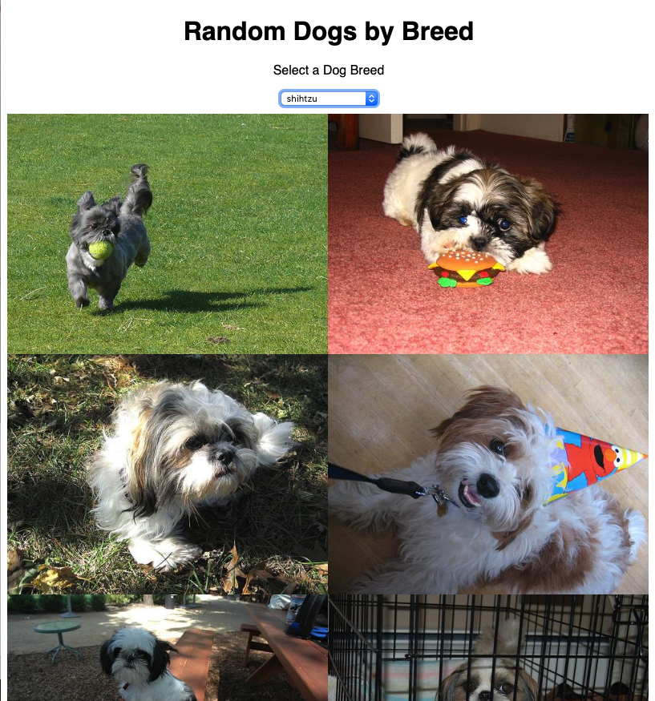

# Networking in React

## Resources

- https://daveceddia.com/ajax-requests-in-react/
- https://dog.ceo/dog-api/
- https://github.com/axios/axios

## Objectives

- Use axios to make network calls in a React app
- Create components that pass the results of networks calls to children

# Introduction

Last lesson, we saw how lifecycle methods can be used to call functions at specific times. In this lesson, we'll integrate networking into our lifecycle methods to load images asynchronously.

## `axios` Refresher

We will use axios to make our network calls. For more of a refresher, check out the lesson [here](https://github.com/joinpursuit/Pursuit-Core-Web/tree/master/html_css_dom/axios+async-await). In brief, we use axios to asynchronously make a network call. The syntax looks like:

```js
const fireRequest = async () => {
  try {
    const posts = await axios.get("https://jsonplaceholder.typicode.com/posts");
    console.log(posts);
  } catch (e) {
    console.log(e);
  }
}
```


# Network Calls Inside a Component

[Project Link](https://codesandbox.io/s/random-dog-pictures-yuo8x)

We will start by making an app that loads a random image of a dog, with a button to load a new random image.


We will be making `GET` requests to the [/api/breeds/image/random](https://dog.ceo/api/breeds/image/random) route on this API to get a URL to a random dog picture. The response we get from the API is a JSON object that looks likes this:

```JSON
{
  "status": "success",
  "message": "https://dog.ceo/api/img/bulldog-french/n02108915_618.jpg"
}
```

## Create a Scaffold

Create a new project using Create React App. Install axios by running `npm install --save axios`.

## App.js

Start by creating your main `App` file. This will load a header, then our `Dog` component below it.

```js
import React from "react";
import ReactDOM from "react-dom";
import Dog from "./Dog";

const App = () => {
  return (
    <>
       <h1> Random Dog Pictures v1 </h1>
      <Dog />
    </>
  );
}

const rootElement = document.getElementById("root");
ReactDOM.render(<App />, rootElement);
```

But, wait. We're importing `Dog.js` but we don't have a `Dog.js` in our project! Let's fix that:

## Dog.js

Start by setting up a basic scaffold:

```js
import React from "react";
import axios from "axios";

class Dog extends React.PureComponent {
  render() {
    return (
      <>
        <p>IMAGE PLACEHOLDER</p>
        <button>Load new Dog</button>
      </>
    );
  }
}

export default Dog;
```

Now, we want to request the API, fetch an image, and render it. But how? When this component is initially rendered, we don't know the image URL yet. We have to set up our `render` function to handle two different instances: 

* The component before we've fetched an image from the API.
* After an image is loaded from the API.

The way to do this is in React is to use state. We can have the state track the current URL for our `img` tag's `src`, and consume that URL in our `render` function.

The constructor below will set our initial state:

```js
constructor() {
  super();
  this.state = {
    imgURL: ""
  };
}
```

Now, our `render` can be updated to include an image, rather than our placeholder `p` tag:

```js
render() {
  const { imgURL } = this.state;
  return (
    <>
      
      <button>Load new dog</button>
    </>
  );
}
```

Initially, because the default value for our `imgURL` is an empty string, the component will render without a visible image. Whenever the `imgURL` in the state changes, `render` will be called again and the UI will update with the new image. Right now, our `imgURL` is always set to an empty string. 

Now, let's add a method to get this image URL and set it in the state:

```js
getRandomImage = async () => {
  try {
    const { data } = await axios.get("https://dog.ceo/api/breeds/image/random");
    this.setState({
      imgURL: data.message
    });
  } catch(e) {
    console.log(e);
  }
};
```

We'll call this method when the component mounts to load an initial image - no button-clicking required:

```js
componentDidMount() {
  this.getRandomImage();
}
```

We'll also pass `getRandomImage` into our button's `onClick` hook:

```js
render() {
  const { imgURL } = this.state;
  return (
    <>
      
      <button onClick={this.getRandomImage}>Load new dog</button>
    </>
  );
}
```

Great! Now we've got images loading. However, the API is giving us images in all different sizes. We can handle this with CSS. In React, there are different ways to handle CSS. [See here to learn more about them](https://reactjs.org/docs/faq-styling.html). Let's apply some CSS inline to see an example. Below, we define a variable, `styles`, and pass `styles.img` as the `style` attribute to the `img` element. Inline styling has its tradeoffs, and is almost never used inside a production app. To learn more, see [here](https://reactjs.org/docs/dom-elements.html#style).

```js
render() {
  const { imgURL } = this.state;
  const styles = {
    img: {
      height: "15em"
    }
  };

  return (
    <>
      
      <button onClick={this.getRandomImage}>Load new dog</button>
    </>
  );
}
```
<details>
<summary>
  <strong>See the whole component put together</strong>
</summary>

```js
import React from "react";
import axios from "axios";

class Dog extends React.PureComponent {
  constructor() {
    super();
    this.state = {
      imgURL: ""
    };
  }

  componentDidMount() {
    this.getRandomImage();
  }

  getRandomImage = async () => {
  try {
    const { data } = await axios.get("https://dog.ceo/api/breeds/image/random");
    this.setState({
      imgURL: data.message
    });
  } catch(e) {
    console.log(e);
  }
};

  render() {
    const { imgURL } = this.state;
    const styles = {
      img: {
        height: "15em"
      }
    };

    return (
      <>
        
        <button onClick={this.getRandomImage}>Load new dog</button>
      </>
    );
  }
}

export default Dog;
```
</details>
<br />

# Passing Data Down

[Project Link](https://codesandbox.io/s/random-dogs-by-breed-forked-1wzsq)

Another common pattern is to separate responsibility between parent components that make network calls and child components that render that network data. In order to accomplish this, we use **props** to pass data down from parent to child. 

Here, we'll use the Dog API to load a list of breeds into a `select` input. When the user selects a breed from that list, we'll load 5 random pictures of dogs of that breed.



The following two endpoint will be useful:

- https://dog.ceo/api/breeds/list/all
- https://dog.ceo/api/breed/hound/images

## Data Organization

Before we start writing our application, it's a good idea to think about where we want our data to be, which components will render what, and how they'll all work together. In this case, there will be two main sections of our app:

- A `select` that populates with dog breeds, allowing the user to select a breed to see pictures of.
- A feed that renders pictures of dogs of the selected breed.

These sections will have separate concerns, but will need to share information: Namely, which breed is selected. We can, therefore, assume that our component structure will include a parent of these two components that stores the selected breed in state, rendering each component and passing the selected breed down as a prop.

## DogsContainer.js

Let's build our feed of dog iamges first. This container will take a "breed" into its props, then use that breed to make a request to the Dog API. When our component gets a response back, it will set its state with the URLs for 5 dog images. Its render method will then build a `Dog` component for each url.

```js
import React from "react";
import Dog from "./Dog";
import axios from "axios";

import "./DogsContainerStyles.css";

class DogsContainer extends React.PureComponent {
  constructor(props) {
    super(props);
    this.state = {
      numberOfDogs: 5,
      imageURLs: []
    };
  }

  render() {
    const { imageURLs } = this.state;
    return (
      <div id="dogsContainerDiv">
        {imageURLs.map(url => {
          return <Dog imgURL={url} key={url} />;
        })}
      </div>
    );
  }
}

export default DogsContainer;
```

Our constructor sets the initial state with the number of dog images we want to display (`numberOfDogs`), and an empty array of `imageURLs`. Our `render` method then maps the array, passing each URL to individual `Dog` components, each rendering an `img` tag.

To start, no images will display. When a user selects a breed, this component will update, receiving the selected breed from its parent. Remember, this component does not handle our `select` input. The only things this component handles are: 1) making a network request based on a recieved prop, and 2) rendering the images it gets from that request. Therefore, our `componentDidUpdate` method handles this first part:

```js
  componentDidUpdate(prevProps) {
    const oldBreed = prevProps.selectedBreed;
    const newBreed = this.props.selectedBreed;
    const numberOfDogs = this.state.numberOfDogs;

    if (oldBreed !== newBreed) {
      this.getRandomDogImagesByBreed(newBreed, numberOfDogs);
    }
  }
```

Note that in `componentDidUpdate`, we only make a network call if the breed has changed. This is to prevent an infinite loop, because `componentDidUpdate` is called each time the component renders itself, and `getRandomDogImagesByBreed` updates the state. Speaking of, let's take a look at that one:

```js
 getRandomDogImagesByBreed = async (breed = "beagle", numberOfDogs = 5) => {
    const breedURL = `https://dog.ceo/api/breed/${breed}/images/random/${numberOfDogs}`;

    try {
      const { data } = await axios.get(breedURL);
      const allImageURLs = data.message;

      this.setState({
        imageURLs: allImageURLs
      });
    } catch (e) {
      console.log(e);
    }
  }
```

This component is doing a few things. First, it's defining a few default values for our arguments, just in case our function is called without any. Then, it's assembling a `breedURL` using standard template literal syntax. Finally, it's making a network call to the Dog API and setting our state with the image URLs it gets in return. This, in turn, triggers a re-render on our component, mapping through our newfound URLs and rendering them to the user.

## Dog.js

While our feed of dog images could render the `img` tags itself, it's always a nice idea to have simple components to keep things clean. `Dog.js` will be responsible for exactly two things: Accepting an image URL as a prop and rendering it in an `img` tag:

```js
import React from "react";
import "./DogStyles.css";

const Dog = (props) => {
  const { imgURL } = props;
  return (
    <div className="dog">
      
    </div>
  );
};

export default Dog;
```

With our `Dog` and `DogsContainer` components built, we can now build a `DogBreedSelector` component which handles our user input.

## DogBreedSelector.js

```js
import React from "react";
import axios from "axios";

class DogBreedSelector extends React.PureComponent {
  constructor(props) {
    super(props);
    this.state = {
      breeds: []
    };
  }
}

export default DogBreedSelector;
```

Let's break down what `DogBreedSelector` should do.

Staring off our class, we will take in a method `handleSelectedBreed` into props that we can call to inform the parent component which breed the user selected. To be clear: **`DogBreedSelector` will not store the selected breed in state. Its parent will.** However, `DogBreedSelector` will handle fetching a list of breeds from the Dog API. That's what our `breeds` part of state is for.

When the user selects a breed, we will set the parent's state to the new value, calling the method passed into props so that the parent component can handle the new breed:

```js
handleSelectChange = (event) => {
  const { handleSelectedBreed } = this.props;
  const newBreed = event.target.value;
  handleSelectedBreed(newBreed);
};
```

Next, we can implement a `loadBreeds` method that updates the state with all of the breeds from the API:

```js
componentDidMount() {
  this.loadBreeds();
}

loadBreeds = async () => {
  const { data } = await axios.get("https://dog.ceo/api/breeds/list/all");
  const breedList = Object.keys(data.message);

  this.setState({
    breeds: breedList
  });
};
```

And finally we can build our `render()` method to render the select:

```js
render() {
  const { breeds } = this.state;
  const { selectedBreed } = this.props;

  const breedOptions = breeds.map((breed) => {
    return (
      <option value={breed} key={breed}>
        {breed}
      </option>
    );
  });

  return (
    <>
      <p>Select a Dog Breed</p>
      <select onChange={this.handleSelectChange} value={selectedBreed}>
        <option value={""} key={""} />
        {breedOptions}
      </select>
    </>
  );
}
}
```

*Discussion question: Why isn't `DogBreedSelector` storing the selected breed in state? Hint: What other components need access to the selected breed?*

## index.js

We can now build our final component that brings the `DogsContainer` and the `DogBreedSelector` together.

```js
import React from "react";
import ReactDOM from "react-dom";

import "./styles.css";
import DogsContainer from "./DogsContainer";
import DogBreedSelector from "./DogBreedSelector";

class App extends React.PureComponent {
  constructor() {
    super();
    this.state = {
      selectedBreed: ""
    };
  }

  handleSelectedBreed = breed => {
    this.setState({ selectedBreed: breed });
  };

  render() {
    const { selectedBreed } = this.state
    return (
      <div className="App">
        <div>
          <h1>Random Dogs by Breed </h1>
          <DogBreedSelector
            selectedBreed={selectedBreed}
            handleSelectedBreed={this.handleSelectedBreed}
          />
        </div>
        <DogsContainer selectedBreed={selectedBreed} />
      </div>
    );
  }
}

const rootElement = document.getElementById("root");
ReactDOM.render(<App />, rootElement);
```

We finally get a clear picture of how our app is working here. At first, our `DogBreedSelector` makes a call on `componentDidMount` to the Dog API to fetch a list of dog breeds. The user clicks one. `DogBreedSelector` calls this parent component's `handleSelectedBreed`, which our `DogBreedSelector` receives as a prop. State is updated in the parent component with the selected breed, the component re-renders, and the selected breed is passed down to `DogsContainer`. `DogsContainer` then calls `componentDidUpdate`, notices the new props, and makes a call to the Dog API to get five images. Finally, they're rendered. Phew!

# Conclusion

Lifecycle methods are a powerful tool that allows us to fire network calls at the appropriate time. We can create components that make their own network calls, as well as components that make network calls and pass the results of those calls down to child components.
