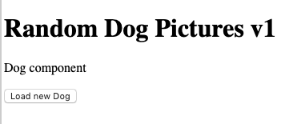

# Networking in React

# Resources

- https://daveceddia.com/ajax-requests-in-react/
- https://dog.ceo/dog-api/
- https://github.com/axios/axios

# Objectives

- Use axios to make network calls in a React app
- Create components that pass the results of networks calls to children

# 1. Introduction

Last lesson we saw how lifecycle methods can be used to call functionality at specific times.  In this lesson, we'll integrate networking into our lifecycle methods to seamlessly load images asynchronously.

We will use the `componentDidMount` lifecycle method which is called as soon as a component is inserted into the DOM tree.  In doing so, we can get around the more clunky VanillaJS way of setting up an observer on `DOMContentLoaded`.  This also allows us to easily separate out different pieces of our application, and ensure that it only makes network calls when it's displayed on the screen.


# 2. axios Refresher

We will use axios to make our network calls.  For more of a refresher, check out the lesson [here](https://github.com/joinpursuit/Pursuit-Core-Web/tree/master/html_css_dom/axios+async-await).  In brief, we use axios to asynchronously make a network call.  The syntax looks like:

```js
function fireRequest() {
  axios
    .get("https://jsonplaceholder.typicode.com/posts")
    .then(response => {
      console.log(response.data);
    })
    .catch(err => {
      console.log(err);
    });
}
```


# 3. Making a component that makes a network call. Random Dog Pictures v1

[Project Link](https://codesandbox.io/s/random-dog-pictures-yuo8x)

We will start by making an app that loads an image of a dog, with a button to load a new image.


We will be making AJAX `GET` requests to the [/api/breeds/image/random](https://dog.ceo/api/breeds/image/random) route on this API to get a URL to a random dog picture. The response is a JSON object that looks likes this:

```JSON
{
  "status": "success",
  "message": "https://dog.ceo/api/img/bulldog-french/n02108915_618.jpg"
}
```

## Create a CodeSandbox scaffold

Create a new [React Sandbox](https://codesandbox.io/explore).

To use axios on CodeSandbox, we need add it as a dependency to our project. We do this in he left-hand side menu, by clicking on `dependencies` -> `Add Package`, typing _axios_ in the new window and clicking on the first result. Then, we import the _axios_ library to our project by adding an `import` statement:

```js
import axios from 'axios'
```

This is equivalent to writing, in a local React project, `npm install --save axios`.

## App.js

Start by creating your main `App` file.  This will load a header, then our `Dog` component below it.

```js
import React from "react";
import ReactDOM from "react-dom";
import Dog from "./Dog";

function App() {
  return (
    <div>
       <h1> Random Dog Pictures v1 </h1>
      <Dog />
    </div>
  );
}

const rootElement = document.getElementById("root");
ReactDOM.render(<App />, rootElement);
```

It should give you an error saying that "A cross-origin error was thrown".  This is because we haven't created a `Dog` component yet.  Let's add one now:

## Dog.js

Start by creating the basic scaffold:

```js
import React from "react";
import axios from "axios";

class Dog extends React.PureComponent {
  render() {
    return (
      <div>
        <p>Dog component</p>
        <button>Load new Dog</button>
      </div>
    );
  }
}

export default Dog;
```

You should see the image below:



Now we want to get an image loaded instead of the `p` tag.  How should we change the image each time the button is pressed?  The way to do this is in React is to use state.  We can have the state track the current url for the img src, and use JSX to set the img src property.

The constructor below will set our initial state:

```js
constructor() {
  super();
  this.state = {
    imgURL: ""
  };
}
```

And our render can be updated to include an image:

```js
render() {
  const { imgURL } = this.state;
  return (
    <React.Fragment>
      
      <p>
        <button>Load new dog</button>
      </p>
    </React.Fragment>
  );
}
```

Now, whenever the imgURL in the state changes, render will be called again and update the UI with the new image.  Right now, our imgURL is always set to an empty string.  We need to add a method that our component calls that loads the random URL:

```js
getRandomImage = () => {
  axios
    .get("https://dog.ceo/api/breeds/image/random")
    .then(response => {
      this.setState({
        imgURL: response.data.message
      });
    })
    .catch(err => {
      console.log("error fetching image");
    });
};
```

And we can call our method when the component mounts:

```js
componentDidMount() {
  this.getRandomImage();
}
```

We can also tie the same `getRandomImage` method to clicking on the button.

```js
render() {
  const { imgURL } = this.state;
  return (
    <React.Fragment>
      
      <p>
        <button onClick={this.getRandomImage}>Load new dog</button>
      </p>
    </React.Fragment>
  );
}
```

Great!  Now we've got images loading.  They're all different sizes though.  We can handle this with CSS. In React there are different ways to deal with CSS [see here to learn about them](https://reactjs.org/docs/faq-styling.html). Let's apply some CSS inline to see an example. We can define a variable `styles` like the one below and pass `styles.img` as the `style` attribute to the `img` element. Inline styling has its tradeoffs to learn more see [here](https://reactjs.org/docs/dom-elements.html#style).

```js
const styles = {
  img: {
    height: "15em"
  }
};

render() {
  const { imgURL } = this.state;
  return (
    <React.Fragment>
      
      <p>
        <button onClick={this.getRandomImage}>Load new dog</button>
      </p>
    </React.Fragment>
  );
}
```
<details>
<summary>
  <strong>See the whole component put together</strong>
</summary>

```js
import React from "react";
import axios from "axios";

class Dog extends React.PureComponent {
  constructor() {
    super();
    this.state = {
      imgURL: ""
    };
  }

  componentDidMount() {
    this.getRandomImage();
  }

  getRandomImage = () => {
    axios
      .get("https://dog.ceo/api/breeds/image/random")
      .then(response => {
        this.setState({
          imgURL: response.data.message
        });
      })
      .catch(err => {
        console.log("error fetching image");
      });
  };

  render() {
    const { imgURL } = this.state;
    return (
      <React.Fragment>
        
        <p>
          <button onClick={this.getRandomImage}>Load new dog</button>
        </p>
      </React.Fragment>
    );
  }
}

const styles = {
  img: {
    height: "15em"
  }
};

export default Dog;
```
</details>

# 4. Making a component that passes down results of a network call. Random Dog Pictures v2

[Project Link](https://codesandbox.io/s/random-dogs-by-breed-1frs3)

We've just made a component that can make a network call.  Another useful strategy is to make a component that makes a network call, then passes the results of that call through props.  Here, we'll use Dog API to load a list of breeds into a `select`, then load 10 random dogs of that given breed.


The following two endpoint will be useful:

- https://dog.ceo/api/breeds/list/all
- https://dog.ceo/api/breed/hound/images

## Dog.js

Our `Dog` class will be similar to our our example above, except it won't need a button to refresh an image:

```js
import React from "react";
import "./DogStyles.css";

const Dog = props => {
  return (
    <div className="gog">
      
    </div>
  );
};

export default Dog;
```

### DogStyles.css

```css
.Dog {
  height: 300px;
  width: 400px;
  overflow: hidden;
}

.Dog img {
  height: auto;
  width: 400px;
}
```

Now, we want to build a container for our `Dog` objects.  The container will take in a "breed" into its props, then use that breed to make a request to the Dog API.  When it gets a response back, it will set its state with the URLs for 10 dog images.  Its render method will then build a `Dog` component for each url.

```js
import React from "react";
import Dog from "./Dog";
import axios from "axios";

import "./DogsContainerStyles.css";

class DogsContainer extends React.PureComponent {
  constructor(props) {
    super(props);
    this.state = {
      numberOfDogs: 10,
      imageURLs: []
    };
  }

  render() {
    const { imageURLs } = this.state;
    return (
      <div id="dogsContainerDiv">
        {imageURLs.map(url => {
          return <Dog imgURL={url} key={url} />;
        })}
      </div>
    );
  }
}

export default DogsContainer;
```

Our constructor sets the initial state to have 10 dogs to display, and an empty array of imageURLs.  Our render method then maps the array to `Dog` components.

When our updates(because a new breed was selected), we want to get ten random URLs for dogs that match the breed in the `DogsContainers` props:

```js
  componentDidUpdate(prevProps) {
    const oldBreed = prevProps.selectedBreed;
    const newBreed = this.props.selectedBreed;
    const numberOfDogs = this.state.numberOfDogs;

    if (oldBreed !== newBreed) {
      this.getRandomDogImagesByBreed(newBreed, numberOfDogs);
    }
  }
```

Note that in `componentDidUpdate` we only make a state changing network call if the breed has changed.  This is to prevent an infinite loop, because `componentDidUpdate` is called each time the component renders itself.  Now we can implement the `getRandomDogImagesByBreed` method:

```js
 getRandomDogImagesByBreed(breed, numberOfDogs) {
    if (!breed) {
      return;
    }

    const breedURL = `https://dog.ceo/api/breed/${breed}/images/random/${numberOfDogs}`;
    console.log(breedURL);

    axios
      .get(breedURL)
      .then(response => {
        const allImageURLs = response.data.message;

        this.setState({
          imageURLs: allImageURLs
        });
      })
      .catch(error => {
        console.log(error);
      });
  }
```

This makes an axios call to get 10 radom Dog pictures URLs matching a given breed, then set the state with them saving them to the `imageURLs` array.


Finally, we can add some styles to line up the `Dog` components:

### DogsContainerStyles.css

```css
#dogsContainerDiv {
  display: grid;
  grid-template-columns: 1px;
}
```

With our `Dog` and `DogsContainer` built, we can now build a `DogBreedSelector` component where the breed is selected.

## DogBreedSelector.js

```js
import React from "react";
import axios from "axios";

class DogBreedSelector extends React.PureComponent {
  constructor(props) {
    super(props);
    this.state = {
      breeds: []
    };
  }
}

export default DogBreedSelector;
```

Staring off our class, we will take in a method `handleSelectedBreed` into props that we can call to inform the parent component which breed the user selected.  We then set the initial state with a "selectedBreed" to track the selection, and a "breeds" array where we will store all of the dog breeds we get back from the network call.

When the select changes, we will set the state to the new value, and call the method passed into props so that the parent component can handle the new breed.

```js
handleSelectChange = event => {
  const newBreed = event.target.value;
  this.props.handleSelectedBreed(newBreed);
};
```

Next, we can implement a loadBreeds method that updates the state with all of the breeds from the API:

```js
componentDidMount() {
  this.loadBreeds();
}

loadBreeds = () => {
  axios
    .get("https://dog.ceo/api/breeds/list/all")
    .then(response => {
      this.setState({ breeds: Object.keys(response.data.message) });
    })
    .catch(error => {
      console.log(`An error occurred: ${error}`);
    });
};
```

And finally we can build our `render()` method to render the select:

```js
render() {
  const { breeds } = this.state;
  const { selectedBreed } = this.props;

  return (
    <React.Fragment>
      <p>Select a Dog Breed</p>
      <select onChange={this.handleSelectChange} value={selectedBreed}>
        <option value={""} key={""} />
        {breeds.map(breed => {
          return (
            <option value={breed} key={breed}>
              {breed}
            </option>
          );
        })}
      </select>
    </React.Fragment>
  );
}
```

## index.js

We can now build our final component that brings the `DogsContainer` and the `DogBreedSelector` together.

```js
import React from "react";
import ReactDOM from "react-dom";

import "./styles.css";
import DogsContainer from "./DogsContainer";
import DogBreedSelector from "./DogBreedSelector";

class App extends React.PureComponent {
  constructor() {
    super();
    this.state = {
      selectedBreed: ""
    };
  }

  handleSelectedBreed = breed => {
    this.setState({ selectedBreed: breed });
  };

  render() {
    return (
      <div className="App">
        <div>
          <h1>Random Dogs by Breed </h1>
          <DogBreedSelector
            selectedBreed={this.state.selectedBreed}
            handleSelectedBreed={this.handleSelectedBreed}
          />
        </div>
        <DogsContainer selectedBreed={this.state.selectedBreed} />
      </div>
    );
  }
}

const rootElement = document.getElementById("root");
ReactDOM.render(<App />, rootElement);
```

The breed is saved as state, then passed into the `DogsContainer` as props.  When the user selects a new breed in the `DogBreedSelector` component, it will call the `handleSelectedBreed` method which updates the state, thus trigging a re-render of the `DogsContainer` with the new breed.

# 5. Wrap-up

Lifecycle methods are a powerful tool that allows us to start network calls at the appropriate time.  We can create components that make their own network calls, as well as components that make network calls and pass the results of those calls down to child components.
