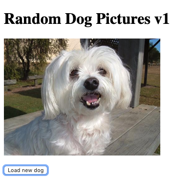

# Networking in React

## Resources

- https://daveceddia.com/ajax-requests-in-react/
- https://dog.ceo/dog-api/
- https://github.com/axios/axios

## Objectives

- Create components that pass the results of networks calls to children
- Further understanding of the react lifecycle

# Introduction

Last lesson, we saw how lifecycle methods can be used to call functions at specific times. In this lesson, we'll integrate networking into our lifecycle methods to load images asynchronously.

# Network Calls Inside a Component

[Project Link](https://codesandbox.io/s/random-dog-pictures-xgjdx)

We will start by making an app that loads a random image of a dog, with a button to load a new random image.



We will be making `GET` requests to the [/api/breeds/image/random](https://dog.ceo/api/breeds/image/random) route on this API to get a URL to a random dog picture. The response we get from the API is a JSON object that looks likes this:

```JSON
{
  "status": "success",
  "message": "https://dog.ceo/api/img/bulldog-french/n02108915_618.jpg"
}
```

## Create a Scaffold

- Create a new project using Create React App.

## App.js

Start by creating your main `App` file. This will load a header, then our `Dog` component below it.

```js
import Dog from "./Dog";

const App = () => {
  return (
    <>
      <h1> Random Dog Pictures v1 </h1>
      <Dog />
    </>
  );
};

export default App;
```

But, wait. We're importing `Dog.js` but we don't have a `Dog.js` in our project! Let's fix that:

## Dog.js

Start by setting up a basic scaffold:

```js
import React from "react";

class Dog extends React.Component {
  render() {
    return (
      <>
        <p>IMAGE PLACEHOLDER</p>
        <button>Load new Dog</button>
      </>
    );
  }
}

export default Dog;
```

Now, we want to request the API, fetch an image, and render it. But how? When this component is initially rendered, we don't know the image URL yet. We have to set up our `render` function to handle two different instances:

- The component before we've fetched an image from the API.
- After an image is loaded from the API.

The way to do this is in React is to use state. We can have the state track the current URL for our `img` tag's `src`, and consume that URL in our `render` function.

The constructor below will set our initial state:

```js
constructor() {
  super();
  this.state = {
    imgURL: ""
  };
}
```

Now, our `render` can be updated to include an image, rather than our placeholder `p` tag:

```js
render() {
  const { imgURL } = this.state;
  return (
    <>
      
      <button>Load new dog</button>
    </>
  );
}
```

Initially, because the default value for our `imgURL` is an empty string, the component will render without a visible image. Whenever the `imgURL` in the state changes, `render` will be called again and the UI will update with the new image. Right now, our `imgURL` is always set to an empty string.

Now, let's add a method to get this image URL and set it in the state:

```js
getRandomImage = () => {
  fetch("https://dog.ceo/api/breeds/image/random")
    .then((response) => response.json())
    .then((json) => {
      this.setState({
        imgURL: json.message,
      });
    })
    .catch((err) => {
      console.log("error fetching image");
    });
};
```

We'll call this method when the component mounts to load an initial image - no button-clicking required:

```js
componentDidMount() {
  this.getRandomImage();
}
```

We'll also pass `getRandomImage` into our button's `onClick` hook:

```js
render() {
  const { imgURL } = this.state;
  return (
    <>
      
      <button onClick={this.getRandomImage}>Load new dog</button>
    </>
  );
}
```

Great! Now we've got images loading. However, the API is giving us images in all different sizes. We can handle this with CSS. In React, there are different ways to handle CSS. [See here to learn more about them](https://reactjs.org/docs/faq-styling.html). Let's apply some CSS inline to see an example.

Below, we define a variable, `styles`, and pass `styles.img` as the `style` attribute to the `img` element. Inline styling has its tradeoffs but is generally not recommended as the primary way to style elements. To learn more, see [here](https://reactjs.org/docs/dom-elements.html#style).

```js
render() {
  const { imgURL } = this.state;
  const styles = {
    img: {
      height: "15em"
    }
  };

  return (
    <>
      
      <button onClick={this.getRandomImage}>Load new dog</button>
    </>
  );
}
```

<details>
<summary>
  <strong>See the whole component put together</strong>
</summary>

```js
import React from "react";

class Dog extends React.Component {
  constructor() {
    super();
    this.state = {
      imgURL: "",
    };
  }

  componentDidMount() {
    this.getRandomImage();
  }

  getRandomImage = () => {
    fetch("https://dog.ceo/api/breeds/image/random")
      .then((response) => response.json())
      .then((json) => {
        this.setState({
          imgURL: json.message,
        });
      })
      .catch((err) => {
        console.log("error fetching image");
      });
  };

  render() {
    const { imgURL } = this.state;
    const styles = {
      img: {
        height: "15em",
      },
    };

    return (
      <>
        
        <button onClick={this.getRandomImage}>Load new dog</button>
      </>
    );
  }
}

export default Dog;
```

</details>
<br />

# Passing Data Down

Let's build upon our app a bit. We will add a text input that lets us choose how many random images the API gives us.

We're going to change the URL we make a request to. This is the before and after:

- `https://dog.ceo/api/breed/image/random/`
- `https://dog.ceo/api/breed/image/random/3`

In order to do this, we need to create a new input component. Let's ask ourselves some questions:

- Where should the new component live?
- Is there new state that we need to keep track of? Where should that state live?
- What exactly needs to happen when we click the `Load new dog` button?

## Build out the static parts

- Create a new component called `NumberOfDogs.js`
  - Have it contain a number input
- Import and render it in `App.js`

```js
import React from "react";

function NumberOfDogs(props) {
  return (
    <div>
      <input type="text" name="" id="" />
    </div>
  );
}

export default NumberOfDogs;
```

```js
import Dog from "./Dog";
import NumberOfDogs from "./NumberOfDogs";

const App = () => {
  return (
    <>
      <h1> Random Dog Pictures v1 </h1>
      <NumberOfDogs />
      <Dog />
    </>
  );
};

export default App;
```

## Set up initial state

- Convert `App.js` to a class component
- Add a state value to it for the `NumberOfDogs` component
- Pass the state into `NumberOfDogs` as a prop
  - Use the prop value internally as the input value
- Pass the state into `Dog` as a prop
  - Use the prop value internally as the number in the API URL

See the complete component examples below:

<details>
  <summary>
  App.js
  </summary>

```js
// App.js

import React from "react";
import NumberOfDogs from "./NumberOfDogs";
import Dog from "./Dog";

export class App extends React.Component {
  constructor() {
    super();

    this.state = {
      dogCount: 1,
    };
  }

  render() {
    return (
      <>
        <h1>Random Dog Pictures v1</h1>
        <NumberOfDogs dogCount={this.state.dogCount} />
        <Dog dogCount={this.state.dogCount} />
      </>
    );
  }
}

export default App;
```
</details>

<details>
  <summary>
  Dog.js
  </summary>

```js
import React from "react";

class Dog extends React.Component {
  constructor() {
    super();
    this.state = {
      imgURL: "",
    };
  }

  componentDidMount() {
    this.getRandomImage();
  }

  getRandomImage = () => {
    const { dogCount } = this.props;
    fetch(`https://dog.ceo/api/breeds/image/random/${dogCount}`)
      .then((response) => response.json())
      .then((json) => {
        this.setState({
          imgURL: json.message,
        });
      })
      .catch((err) => {
        console.log("error fetching image");
      });
  };

  render() {
    const { imgURL } = this.state;
    const styles = {
      img: {
        height: "15em",
      },
    };

    return (
      <>
        
        <button onClick={this.getRandomImage}>Load new dog</button>
      </>
    );
  }
}

export default Dog;
```
</details>

<details>
  <summary>
  NumberOfDogs.js
  </summary>

```js
// NumberOfDogs.js
import React from 'react'

function NumberOfDogs({dogCount}) {
  return (
    <div>
      <input type="text" name="" id="" value={dogCount}/>
    </div>
  )
}

export default NumberOfDogs
```
</details>

## Add events & inverse data flow

Finally we need to make our new components & state interactive. So let's add the events we need to get everything flowing.

We also need to change how the `Dog.js` function handles the new response. The structure has changed a bit because we're now requesting more than one dog image. Instead of just changing the url of one image, we need to render a list of images. We have to do this conditionally because the response depends on the `dogCount` value!

* Add a function in `App.js` to handle the input change
  * The function should set the state of `dogCount`
  * Pass it down as a prop to `NumberOfDogs.js`
  * Set the onChange event in the input to the new prop
* Modify `Dog.js` state so that it has both an `imgURL` and an `images` value
  * Conditionally render either a single image or a list of images


<details>
  <summary>
  App.js
  </summary>

```js
import React from "react";
import NumberOfDogs from "./NumberOfDogs";
import Dog from "./Dog";

export class App extends React.Component {
  constructor() {
    super();

    this.state = {
      dogCount: 1,
    };
  }

  handleDogChange = (e) => {
    const { value } = e.target;
    this.setState({
      dogCount: value,
    });
  };

  render() {
    return (
      <>
        <h1>Random Dog Pictures v1</h1>
        <NumberOfDogs
          dogCount={this.state.dogCount}
          handleDogChange={this.handleDogChange}
        />
        <Dog dogCount={this.state.dogCount} />
      </>
    );
  }
}

export default App;
```
</details>

<details>
  <summary>
  Dog.js
  </summary>

```js
import React from "react";

class Dog extends React.Component {
  constructor() {
    super();
    this.state = {
      images: [],
    };
  }

  componentDidMount() {
    this.getRandomImage();
  }

  getRandomImage = () => {
    const { dogCount } = this.props;
    fetch(`https://dog.ceo/api/breeds/image/random/${dogCount}`)
      .then((response) => response.json())
      .then(({ message }) => {
        const images = typeof message === "string" ? [message] : message;
        this.setState({ images });
      })
      .catch((err) => {
        console.log("Error fetching image", err);
      });
  };

  render() {
    const { images } = this.state;
    const styles = {
      img: {
        height: "15em",
      },
    };

    return (
      <>
        {images.map((image, index) => (
          
        ))}
        <button onClick={this.getRandomImage}>Load new dog</button>
      </>
    );
  }
}

export default Dog;
```
</details>


<details>
  <summary>
  NumberOfDogs.js
  </summary>

```js
import React from "react";

function NumberOfDogs({ dogCount, handleDogChange }) {
  return (
    <div>
      <input
        type="text"
        name=""
        id=""
        onChange={handleDogChange}
        value={dogCount}
      />
    </div>
  );
}

export default NumberOfDogs;
```
</details>

And that should be it! We now have an interactive app in react that fetches data from an API and renders it on the screen!

## Conclusion

This is a common pattern in react apps - using `componentDidMount` to fetch data and set the state, which triggers a re-render to show the results of the fetch.

Are there other ways of structuring this app? Like could the state live somewhere else? Do we need a separate component for `NumberOfDogs`? Should `Dog` contain `NumberOfDogs` as well?

There are lots of possibilities - this is part of learning react. Figuring out how to structure everything, where to store state, and how pass data around comes with practice.
