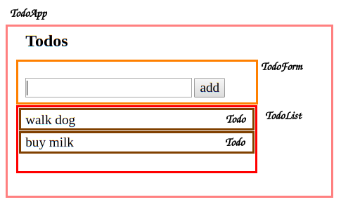

# React Todos - Lesson 1

## Resources

* [React Todos v1 - CodeSandbox](https://codesandbox.io/s/6j50498k8k)
* [Thinking in React](https://reactjs.org/docs/thinking-in-react.html)

## Introduction

In this lesson we will begin building a to-do list app with React. We will make some decisions regarding our app's architecture by keeping the application's state in one place. We will create a single stateful component that holds functional (_stateless_) components.

Alright, let's get started!

## Visual Outline

One way to begin dividing our app into components is to think about it visually. Each component should be responsible for rendering one feature or section of our application.



As illustrated above, we have `TodoApp` as our top-level component. `TodoApp` renders three different types of component:

1. `TodoForm` - renders a form where the user can insert the text for a new todo and submit it (by either clicking on the `add` button or pressing `<enter>`).
2. `TodoList` - renders the container that holds individual `TodoListItem`s.
3. `TodoItem` - renders a single to-do.

The division into components will help us as we add additional functionality to our app.

## [TodoApp](https://codesandbox.io/s/6j50498k8k)

We will start by creating a top-level component we will call `TodoApp`. This component will have a state consisting of two properties:

1. `textInput` - a string representing the user's input in the textbox.
2. `todos` - an array of objects, where each object represents a single to-do item.

```js
class TodoApp extends React.Component {
  constructor() {
    super();
    this.state = {
      textInput: "",
      todos: []
    };
}
```

We have not yet considered what each todo will consist of. The simplest implementation of a list of to-dos is an array of strings:

```js
['walk dog', 'buy milk']
```

However, we prefer to store each to-do as an object. In our current implementation, each to-do will have two fields: `text` and `id`. We will be identifying each to-do by its `id` rather than by its index.

If we're saving the to-dos in a database, we'd set it up so that it would generate a unique id whenever we insert a new to-do. For now, we will use a function that generates ids with a sufficiently high probability of being unique:

```js
const generateId = () => Math.random().toString(34).slice(2);
```

Next, we'll use this `generateId` function in our `addTodo` function:

```js
addTodo = e => {
  e.preventDefault();

  const { textInput, todos } = this.state;
  const newTodo = { text: textInput, id: this.generateId() };
  // using the es6 spread operator to create a new array
  const newTodos = [...todos, newTodo];

  this.setState({
    textInput: "",
    todos: newTodos
  });
};
```

Let's break this function down:

* Since we are adding todos using a form, we first need to call the event's `preventDefault()` method so that the page does not get refreshed.
* To create a new to-do, we define an object with two properties:
  1. `text`, which we extract from the `state`'s `textInput` property.
  2. `id` which we generate by calling the `generateId` function we just made.
* Note that we avoid modifying the existing `todos` array. Instead of using `push` to add the new todo, we create a new array that consists of all the elements from the existing array plus the new to-do. We always try to avoid mutating, or changing, the existing state in React.
* Finally, we call `setState`, setting the `todos` property to equal to the new to-dos array, and setting the `textInput` value to an empty string.

One more custom method we need in our `TodoApp` is `handleTextInput`. For the sake of simplicity, and because there is only one input field, we will set the `textInput` property by name instead of using a computed property name.

Finally, we can define the `render` function. As we determined in the visual outline above, the `TodoApp` component renders the `TodoForm` and `TodoList` components.

```jsx
render() {
  const { textInput, todos } = this.state;
  return (
    <div>
      <h2>Todos</h2>
      <TodoForm
        handleSubmit={this.addTodo}
        textInput={textInput}
        handleTextInput={this.handleTextInput}
      />
      <TodoList todos={todos} />
    </div>
  );
}
```

* We pass the `TodoForm` two methods: `handleTextInput` and `handleSubmit`, and the `textInput` value. Every change in the text input of the `TodoForm` will go through the `TodoApp`s `handleTextInput` method, calling the `TodoApp`'s `setState` function, which will call `render` internally, which will in turn render to `TodoForm` again with the updated input.
* We pass only the array of `todo` objects to the `TodoList`. For now, we will use `TodoList` to render a list of `TodoItem` components. We aren't implementing any extra functionalities, such as removing to-dos, marking them as completed, etc. We are focusing on adding to-dos today.

## `TodoForm.js`, `TodoList.js` and `TodoItem.js`

Now we will go on to define our stateless components. We will use one new syntax here: instead of destructuring the `props` inside the component's `render` function, we will do it when we define it. Note that the following functions are equivalent:

```js
const person = {firstName: 'Nick', middleName: 'Henry', lastName: 'Stone'}

//example Function 1: explicit return w/object destructuring
const getFullName1 = (person) => {
  const { firstName, middleName, lastName } = person;
  return firstName + middleName + lastName;
}

//example Function 2: object destructuring in argument with explicit return
const getFullName2 = ({ firstName, middleName, lastName}) => {
  return firstName + middleName + lastName
};
```

Above in `getFullName2`, we are specifying in the function definition that we are expecting an object with three properties: `firstName`, `middleName` and `lastName`. The object passed in will be destructured, so that we can use each of its properties as a variable, without keying into `props`.

Note, also, that we've previously enclosed our return statements in parentheses `return ( ... )`. In this instance, because it's all on one line, the parentheses have no impact on the code, so we can omit them.

It's important to note here that these pieces of more granular syntactic sugar have **no impact** on the efficiency of your code. If you're more comfortable breaking out your props in the body of your function, or wrapping your return statements in parentheses every time, that's completely fair, and will potentially make your code more readable.

Similarly, we can rewrite the following `TodoList` component:

```jsx
const TodoList = (props) => {
  const { todos } = props;
  return (
    <ul>{todos.map(todo => <Todo todo={todo} />)}</ul>
  );
}
```

In this manner:

```jsx
const TodoList = ({ todos }) => {
  return <ul>{todos.map(todo => <Todo todo={todo} />)}</ul>
};
```

Similarly, we will define the `TodoItem` component as follows:

```jsx
const TodoItem = ({ todo }) => {
  return <li>{todo.text}</li>;
}
```

And finally, the the `TodoForm` component:

```jsx
const TodoForm = ({ handleSubmit, textInput, handleTextInput }) => {
  return (
    <form onSubmit={handleSubmit}>
      <input type="text" value={textInput} onChange={handleTextInput} />
      <button type="submit"> add </button>
    </form>
  );
};
```

We've wrapped this return statement in parentheses because:
  * We're returning multiple lines, and,
  * It makes it far clearer what, exactly, is being returned.

Note, also, in `TodoForm` that any change in the text input will result in the `handleTextInput` function being called.
