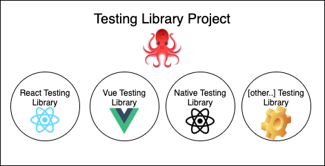
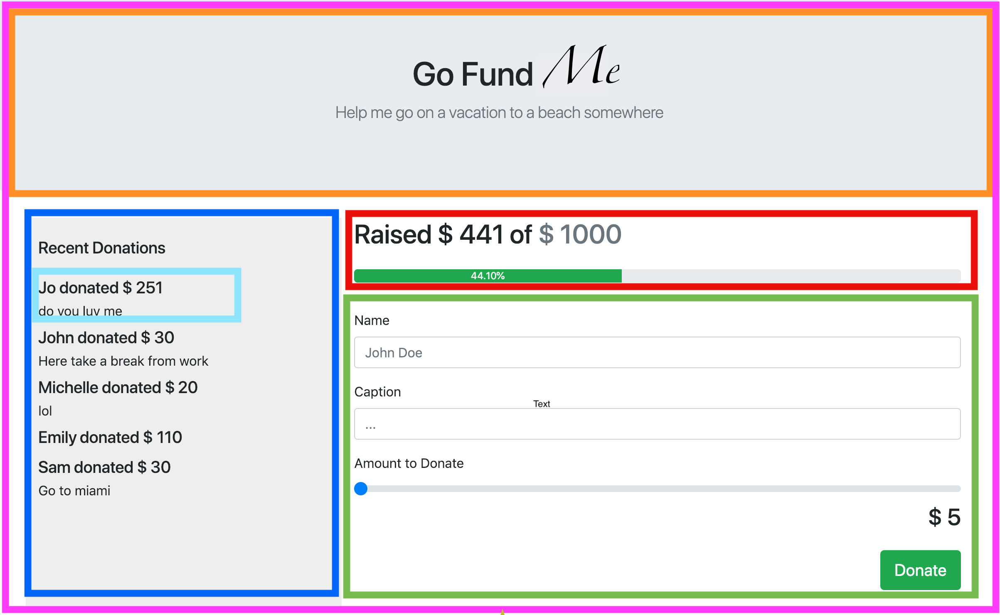
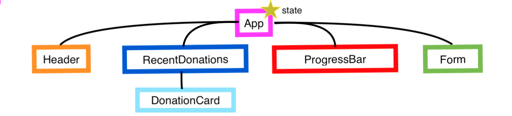
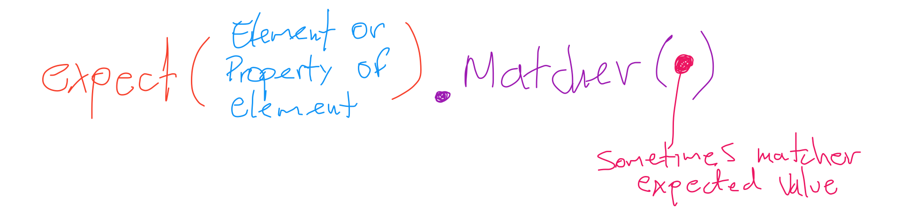

[](https://pursuit.org)

# Testing React Apps & Components

Let's learn how to test React Components in a user-centric way

### Learning Objectives

- Being able to integrate testing into any of your React Apps going forward
- Understand how to test simple individual React Components
- Learn to think about how to test more complex React Components

## Intro

> The more your tests resemble the way your software is used, the more confidence they can give you. - [Testing Library: Guiding Principles](https://testing-library.com/docs/guiding-principles)

Testing your components can give you high confidence that they are working for your users as they are supposed to.
To accomplish this we will test our components with the [React Testing Library](https://testing-library.com/docs/react-testing-library/intro) which is part of the [Testing Library Project](https://testing-library.com/). 



We want our tests to simulate as closely as possible what a user would see and do with our App components. 
the React Testing Library enables us to test our components for [**functionality** and not for **implementation**](https://testing-library.com/docs/intro); so that, if in the future
we refactor our components, say we move from react state to hooks (implementation) but functionality is unaffected our users should remain happy and our tests should still pass.


### Types of Testing in general

#### Unit Testing


Testing the smallest possible unit of your code, usually single functions or single components. Write lots of these!

#### Integration Testing


Testing the "contract" between units in this case components. This means testing that several components of your app that interact work well together, that they **integrate** with no problems.

#### E2E (End-to-End) or System Testing


To test the system or app as a whole generally involves spinning an automated browser to run your entire app and scripting user actions checking that everything works correctly. These test are bigger, slower to run and when they fails hard to debug.

#### How much of each type of test should I write?


Unit Tests > Integration Tests > E2E. Generally more unit tests than integration tests and more integration tests than E2E tests.

#### To Consider
* **Component(Unit) Testing  vs Integration Testing**: With components, the distinction between a “unit” and “integration” test can be blurry. If you’re testing a form, should its test also test the buttons inside of it? Or should a button component have its own test suite? Should refactoring a button ever break the form test?

* **Iteration speed vs Realistic environment**: Testing with the React Testing Library offer us a quick feedback loop between making a change and expecting a result. but it doesn’t model the browser behavior exactly. You must take into account that these tests run in `node` with a mocked DOM ([jsdom](https://github.com/jsdom/jsdom)) and not in a browser. End to End (E2E) testing, on the other hand, done with a tool like [cypress](https://www.cypress.io/) offer us a real browser environment, but reduce the iteration speed and tests are usually are flakier.


## Hands On

### Setup
#### Clone Sample React App
Clone the repo [Testing-React-Apps Starter App](https://github.com/joinpursuit/Pursuit-Core-Web-Testing-React-Apps-Starter). You might remember the GoFundMe app from our React Props Lab

#### Tools
* [Jest](https://jestjs.io/)
* [React Testing Library](https://testing-library.com/)
* [jest-dom](https://github.com/testing-library/jest-dom) (comes with React Testing Library, but you will need the docs)
* [user-event](https://github.com/testing-library/user-event) (comes with React Testing Library, but you will need the docs)

#### Installation
:warning: You don't need to install anything manually because you have a React App bootstrapped with `create-react-app`. If your app was **not** created with `create-react-app` you **will** need to install the tools mentioned above

* Jest has been integrated into Apps made with `create-react-app` since long ago via the `react-scripts` package. 
* The React Testing Library is also included in apps that were created with recent versions of `create-react-app` (v3.3.0 and above). If you inspect your package.json you should see something like this 
  ```
  "@testing-library/jest-dom": "^4.2.4",
  "@testing-library/react": "^9.5.0",
  "@testing-library/user-event": "^7.2.1",
  ```
✅ To run our test we will only need to run them with `npm test`

🚧 If you are having trouble setting up or you need a custom setup make sure to take a look at the [docs](https://testing-library.com/docs/dom-testing-library/setup)

#### Enable VScode Jest Autocompletion/Intellisense
Save the following snippet as `jsconfig.json` at the root of your app directory.
```json
{
  "typeAcquisition": {
    "include": [
      "jest"
    ]
  }
}
```

This will tell VScode to provide Autocompletion/Intellisense for your Jest expectations and matchers. See more info [here](https://code.visualstudio.com/docs/nodejs/working-with-javascript#__javascript-projects-jsconfigjson).


### App Review
Let's review the App we are going to test. This is a GoFundMe page replica.
This App is implemented as outlined in the screenshot below. Each rectangle is a separate React Component. 


For this App we end up with a component tree that could be represented as follows


### Writing Tests

#### __tests__ Directory
Inside of `src/Components/` create a directory called `__tests__`. Here we will write our tests files. It is common practice to have a `__tests__` directory that contains all your tests.

#### Testing DonationCard
Let's first test our component `DonationCard`. This is a simple component that is used as a list item in the **Recent Donations** section. By itself it takes a Donor's `name`, `message` and `amount` as props and displays them. Take a look at it bellow.

```jsx
// Components/DonationCard.js
import React from 'react';

const Donation = (props) => {
  return (
    <li className="media my-2">
      <div className="media-body">
        <h5 className="mt-0 mb-1">{props.name} donated ${props.amount}</h5>
        <p>{props.message}</p>
      </div>
    </li>
  )
}

export default Donation;
```

##### Test File
Let's test that when this component renders, it displays the information that was passed as props in the correct format.

Create a file `__tests__/DonationCard.test.js`
Let's read the test carefully, it should give us an idea of what it is doing.

```js
// __tests__/DonationCard.test.js
import React from 'react';
import { render, screen } from '@testing-library/react';
import DonationCard from '../DonationCard';

test('DonorCard displays donor name, message and ammount', () => {

  // Render the component
  render(<DonationCard name="Alejo" message="Good Luck" amount="100" />)

  // Get elements by the expected text and assert they're displaying (in the document)
  const donationHeading = screen.getByText("Alejo donated $100")
  const donationMessage = screen.getByText("Good Luck")

  expect(donationHeading).toBeInTheDocument()
  expect(donationMessage).toBeInTheDocument()
})
```

##### Explanation
* React must always be in scope (context). That is why we need `import React from 'react';`
* We import `render` and `screen` from `@testing-library/react`.
  1. `render` lets us render a component
  2. `screen` lets us query to see if something is being rendered. `screen.getByText` is one of the queries we can use. `getByText` is a query that will return the first element in the screen that matches its argument string. There are many more queries available. See [Queries](https://testing-library.com/docs/dom-testing-library/api-queries) to learn more.
  3. `expect(donationHeading).toBeInTheDocument()`. Lets expect to have found a heading and a message being rendered and that they are in the document. `toBeInTheDocument` is a matcher that comes from `jest-dom`. Make sure to acquaint yourself with all [its matchers](https://github.com/testing-library/jest-dom), they will come very handy.

Run your test with `npm test` and check if it passes.

##### Exercise
* Change something in DonationCard that would make your test fail.
* Share what you changed with the rest of the class or a neighbor

#### Common Queries & Matchers
| Queries (screen.*)      |                      |                          |                  |
| ----------------------- | -------------------- | ------------------------ | ---------------- |
| `getByText`             | `getAllByText`       | `getByDisplayValue`      | `getByLabelText` |
| `findByPlaceHolderText` | `findByDisplayValue` | `findByRole`             |
| `queryByText`           | `queryByLabelText`   | `queryByPlaceholderText` |

⚠️  Find the similarities and differences between `get*`, `query*` and `find*` in the [docs here](https://testing-library.com/docs/dom-testing-library/api-queries)

| DOM Matchers [(jsdom)](https://github.com/testing-library/jest-dom) |                |                      |               |
| ------------------------------------------------------------------- | -------------- | -------------------- | ------------- |
| `toBeInTheDocument`                                                 | `toHaveValue`  | `toHaveDisplayValue` | `toBeChecked` |
| `toBeDisabled`                                                      | `toBeRequired` |

⚠️  See [jsdom-jest docs](https://github.com/testing-library/jest-dom) for more

| Jest Matchers |              |                    |            |
| ------------- | ------------ | ------------------ | ---------- |
| `toBe`        | `toEqual`    | `toHaveBeenCalled` | `toBeNull` |
| `toMatch`     | `toBeTruthy` | ...                |            |

⚠️  See [Jest docs](https://jestjs.io/docs/en/expect) for more

#### Structure of an Assertion



#### Testing ProgressBar
Similar to how we tested `DonationCard` now you test the `ProgressBar` component. Take a look at `ProgressBar.jsx` and make sure you understand the component first.

Implement the following tests

```js
test('Displays the raised amount of total in the format: Raised $[amount] of $[total] in a heading', () => {})
test('Displays progress bar with proper percentage', () => {})
```

##### Test: Displays the raised amount of total in the format: Raised $[amount] of $[total] in a heading

```js
describe('ProgressBar', () => {
  test('Displays the raised amount of total in the format: Raised $[amount] of $[total] in a heading', () => {
    const targetAmount = 1000
    const raisedAmount = 170

    render(<ProgressBar targetAmount={targetAmount} raisedAmount={raisedAmount} />)

    const statusHeading = screen.getByText(`Raised $${raisedAmount} of $${targetAmount}`)
    expect(statusHeading).toBeInTheDocument();
  })
})
```

This is most likely what you tried to do. However your test should be failing and giving you a hint as to why

```
Unable to find an element with the text: Raised $170 of $1000. 
This could be because the text is broken up by multiple elements. 
In this case, you can provide a function for your text matcher to make your matcher more flexible.
```

If we look into our component, we have a span with className `"text-muted"` inside our heading where we display the target amount. This is so that the target amount is styled with a different color. When our component is rendered we end up with our text being broken up by multiple elements. 

```html
<h2 class="mb-4" > Raised $ 170 of <span class="text-muted" > $1000 </span> </h2>
```

What we can do here is divide our check into two parts
```js
test('Displays the raised amount of total in the format: Raised $[amount] of $[total] in a heading', () => {
  const targetAmount = 1000
  const raisedAmount = 170

  render(<ProgressBar targetAmount={targetAmount} raisedAmount={raisedAmount} />)

  const raised = screen.getByText(`Raised $${raisedAmount} of`)
  const target = screen.getByText(`$${targetAmount}`)

  expect(raised).toBeInTheDocument();
  expect(raised.tagName).toBe('H2')

  expect(target).toBeInTheDocument();
  expect(target.tagName).toBe('SPAN')
  expect(target.parentElement).toBe(raised)
})
```

<details>
  <summary> 💡 Alternative Solution </summary>

```js
test('Displays the raised amount of total in the format: Raised $[amount] of $[total] in a heading', () => {
  const targetAmount = 1000
  const raisedAmount = 170
  const { getByRole } = render(<ProgressBar targetAmount={targetAmount} raisedAmount={raisedAmount} />)

  expect(getByRole('heading')).toHaveTextContent(`Raised $${raisedAmount} of $${targetAmount}`)
})
```
**Note**: Make sure to understand the `getByRole` query and `toHaveTextContent` matcher
</details>


##### Test: Displays progress bar with proper percentage
```js
test('Displays progress bar with proper percentage', () => {
  const targetAmount = 1000
  const raisedAmount = 170
  render(<ProgressBar targetAmount={targetAmount} raisedAmount={raisedAmount} />)

  const progressText = (raisedAmount * 100 / targetAmount) + "%";
  const progressBar = screen.getByText(progressText);
  expect(progressBar).toBeInTheDocument()
  expect(progressBar.style.width).toBe(progressText)
})
```

##### Explanation
Note that this component has a bit of logic to it. It calculates a percentage based on the values for `targetAmount` and `raisedAmount`. How do we test that?

* Render the component as we have done in the past passing some props
* Do the math for what we expect to be displayed
* Get the progress bar element by the expected text that would display. 
* Expect that `progressBar` is in the document and that its width its the same as what is displaying.


#### Testing Form.jsx

The Form component has four tests but we will focus on only two of them. To access the rest of the tests make sure to explore the [GoFundMe App Fully Tested: `tested-app` branch](https://github.com/joinpursuit/Pursuit-Core-Web-Testing-React-Apps-Starter/tree/tested-app)

##### Handles input changes with `handleFormInput` when typing or editing a value
Note that here we are going to test a function that gets passed as props: `handleFormInput`, and we want to check if that function is being called as a user would type text into the form fields. We will do so with [Jest mock functions](https://jestjs.io/docs/en/mock-functions.html)

```js
import React from 'react';
import { render, fireEvent, screen } from '@testing-library/react';
import userEvent from '@testing-library/user-event';
import Form from '../Form';

describe('Form', () => {
  test('Handles input changes with handleFormInput when typing or editing a value', () => {
    const handleFormInputMock = jest.fn()

    render(<Form formDonor={""} formMessage={""} formAmount={""} handleFormInput={handleFormInputMock} />)

    const nameInput = screen.getByLabelText("Name")
    const messageInput = screen.getByLabelText("Message")
    const slider = screen.getByLabelText('Amount to Donate')

    userEvent.type(nameInput, "Bob")
    expect(handleFormInputMock).toHaveBeenCalled()
    expect(handleFormInputMock).toHaveBeenLastCalledWith("nameInput", "Bob")

    userEvent.type(messageInput, "Here to support")
    expect(handleFormInputMock).toHaveBeenLastCalledWith("messageInput", "Here to support")

    fireEvent.change(slider, { target: { value: 500 } })
    expect(handleFormInputMock).toHaveBeenLastCalledWith("amountInput", "500")
  })
})
```

##### Explanation
* **Arrange**
  * Create a Jest Mock function with `jest.fn()`. This will let us check if the function was ever called and with what arguments.
  * Render form and pass `handleFormInputMock` to our component as prop
  * Get input fields by their respective labels (as a user would be able to find them as well) with [`getByLabelText`](https://testing-library.com/docs/dom-testing-library/api-queries#bylabeltext). Make sure to review the [all possible queries](https://testing-library.com/docs/dom-testing-library/api-queries)
* **Act**
  * Using [`userEvent.type()`](https://github.com/testing-library/user-event#async-typeelement-text-options) simulate a user typing text in the fields
  * Using [`fireEvent.change()`](https://testing-library.com/docs/dom-testing-library/api-events) fire a change event on the slider to set it to `500`. 
  **Note**: `fireEvent` is under the hood of all `userEvent` methods. `userEvent` simulates a user better but it does not have a way to simulate moving a slider to a specific value yet. If you can't do it with `userEvent` try with `fireEvent`. To understand make sure to check their respective docs
* **Assert**
  * Check that `handleFormInputMock` was called with `expect(handleFormInputMock).toHaveBeenCalled()`
  * Check that the mock function was called with the expected arguments values last with `expect(handleFormInputMock).toHaveBeenLastCalledWith("nameInput", "Bob")`
  * Other mock [functions matchers](https://jestjs.io/docs/en/mock-functions.html#custom-matchers) are
    * `expect(mockFunc).toHaveBeenCalledWith(arg1, arg2)`

#### Testing form calls handleSubmit when submitted

```js
test('Handle form submission with handleSubmit', () => {
  const handleSubmit = jest.fn()
  render(<Form handleSubmit={handleSubmit} />)

  const form = screen.getByTestId('form')
  fireEvent.submit(form)
  expect(handleSubmit).toHaveBeenCalled()
})
```

###### Explanation
* **Arrange**:
  * Create `handleSubmit` mock function
  * Render the form and pass `handleSubmit` mock function as prop
  * Get the rendered form with `getByTestId`. Note that this is necessary because there is no way to get a form with any of the other queries. This requires that in your component you pass form `data-testid="form"` attribute like so: `<form onSubmit={handleSubmit} data-testid="form">`. Use `data-testid` as a last resource when you cannot get an element by any of the other queries
* **Act**
  * Simulate submitting a form with `fireEvent.submit(form)`
* Assert
  * Check that the mock `handleSubmit` function was called `expect(handleSubmit).toHaveBeenCalled()`

**Notes** Read
* [How to test onSubmit in react-testing-library](https://kula.blog/posts/test_on_submit_in_react_testing_library/)

## Testing Mindset
99% of your tests will need three steps: **Arrange**, **Act** & **Assert**

#### Arrange
Rendering, passing props and prepping your component to be tested
The `render` method renders a React element into the DOM and returns utility functions for testing the component.

#### Act
Fire events and simulate user interaction. The `fireEvent.*` methods and the `userEvent.*` methods allows us to fire events to simulate user actions.

#### Assert
Check with `expect` and matchers that given what was rendered and the user event simulated you got the expected results. For example after the user hits submit you expect a message to appear on the screen.

### Testing App.js

#### Test: Submitting the form makes a POST request
```js
import React from 'react';
import { render, fireEvent, screen } from '@testing-library/react'
import userEvent from '@testing-library/user-event';
import App from '../../App';
import axiosMock from 'axios'

jest.mock('axios')

describe("App", () => {
  test("Submitting a donation makes a POST request to API/posts and adds a new recent donation", async () => {
    axiosMock.post.mockResolvedValueOnce({
      data: {
        "name": "James Bond",
        "message": "Bon Voyage ",
        "amount": "500",
        "id": 101
      }
    })

    // Render the App
    render(<App />)

    // Find elements that are rendering in the screen. We could consider this an 
    // implicit assertion because if the elements are not found the test will fail
    const nameInput = screen.getByPlaceholderText('Jon Doe')
    const messageInput = screen.getByPlaceholderText('Good luck')
    const amountSlider = screen.getByRole('slider')
    const donateButton = screen.getByText('Donate')

    // Fire events
    userEvent.type(nameInput, "James Bond")
    userEvent.type(messageInput, "Bon Voyage")
    fireEvent.change(amountSlider, { target: { value: "500" } })
    userEvent.click(donateButton)

    // Expect that that axios.post was called with the correct values
    expect(axiosMock.post).toHaveBeenCalledTimes(1)
    expect(axiosMock.post).toHaveBeenCalledWith(
      "https://jsonplaceholder.typicode.com/posts", {
      amount: "500",
      message: "Bon Voyage",
      name: "James Bond"
    })

    // Wait and expect that after the async operation (Net request) 
    // a new donation is displayed to the user
    const donationHeader = await screen.findByText("James Bond donated $500")
    expect(donationHeader.tagName).toBe("H5")

    const donationMessageP = await screen.findByText("Bon Voyage")
    expect(donationMessageP.tagName).toBe("P")
  })
})
```
For the rest of the tests checkout [`App.test.js`](https://github.com/joinpursuit/Pursuit-Core-Web-Testing-React-Apps-Starter/blob/tested-app/react-app/src/Components/__tests__/App.test.js)
in the [GoFundMe App Fully Tested: `tested-app` branch](https://github.com/joinpursuit/Pursuit-Core-Web-Testing-React-Apps-Starter/tree/tested-app) 


## Other types of Testing
- [Visual Regression Testing](https://applitools.com/blog/visual-regression-testing-developers/)
- [Snapshot Testing](./snapshot-testing.md)

## Summary

Today we:

* Learned how to test a React component
* Became aware of the importance of test our apps
* Learned how to mock functions to pass as props to components
* How to mock network requests results
* Reviewed 3 different types of software testing

### Resources

- [Cheatsheet](./cheatsheet.md)
- [GoFundMe App Fully Tested: `tested-app` branch](https://github.com/joinpursuit/Pursuit-Core-Web-Testing-React-Apps-Starter/tree/tested-app)
- [Testing React Components - React docs](https://reactjs.org/docs/testing.html)
- [Testing Library](https://testing-library.com/docs/react-testing-library/example-intro)
- [Jest documentation](https://jestjs.io/docs/en/getting-started)
- [Jest expect reference](https://jestjs.io/docs/en/expect)
