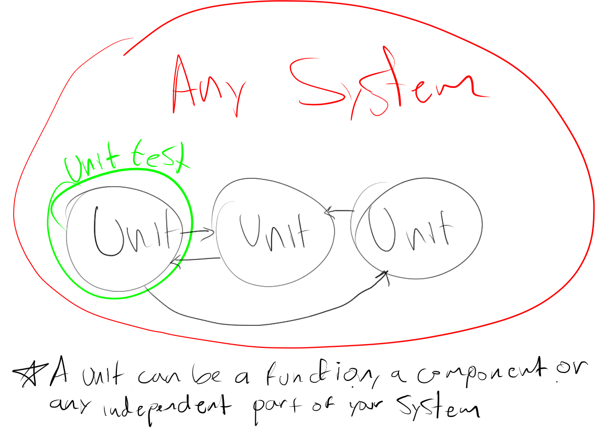
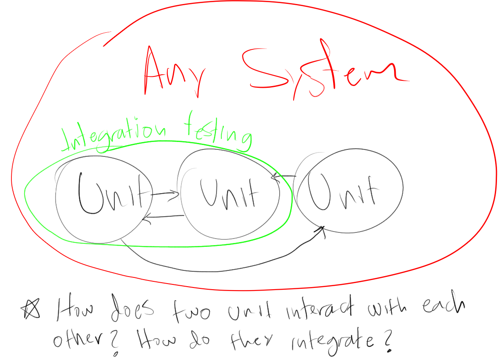
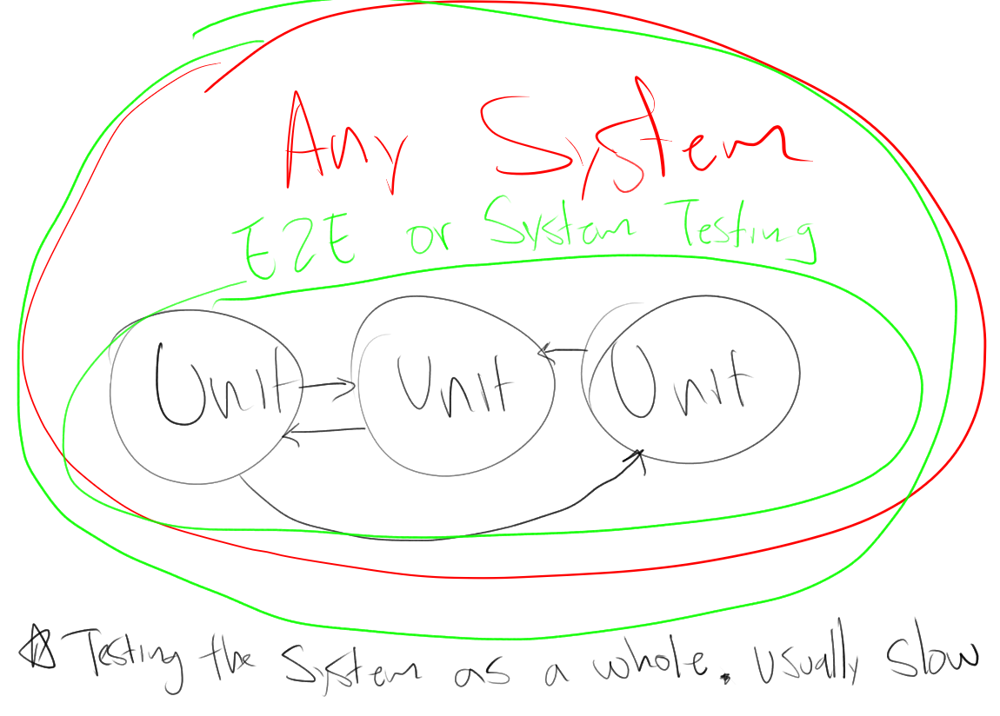
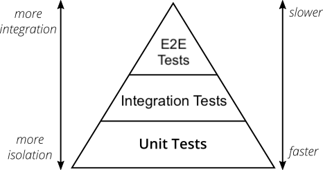

[](https://pursuit.org)

# Testing 

Testing your JavaScript code with Jest!

### Learning Objectives

- Understand why testing is important
- Understand the different types of testing
- Be able to integrate unit testing into any project

### Prerequisites

- Javascript

---

## Outline
* What is testing
  * Why do it

* Types of testing
  * unit
  * integration
  * E2E

## What is testing

Testing is the practice of writing code to verify that your other code is doing what you think it is.

Test code executes your code, passes in various values (that you define) and ensures that it returns the right value.

Testing is an incredibly broad concept with a lot of different thoughts and opinions surrounding it. There are many different testing frameworks available in different languages, but for the most part they are all trying to achieve the same thing: code correctness.

Today we'll look at a popular Javascript testing framework called [Jest](https://jestjs.io/docs/en/getting-started)

## Why should I test my code

Testing is incredibly important for a number of reasons that are amplified when working on larger projects, or with multiple people working on the same project. Testing also benefits you, working alone on a smaller project.

* It helps ensure that when you make changes in one area of an application, other parts aren't affected without you knowing.
* It forces you to write more maintanable and understandable code. If you write code that cannot be tested easily, it's probably not good code and should be changed.
* In the long run, it saves you development & debugging time and helps your project remain stable.


## Types of testing

There are many different types of testing, but here are the most common ones:

### Unit Testing



Unit testing means verifying the code at the smallest possible unit - usually by testing each function individually. In the case that classes exist, this can be mean testing the whole class, or testing the class's methods separately.

Most commonly, unit testing is done _by the developer_ while they are writing the application code. 

In many companies that build software, unit tests are the most foundational type of testing that exists. Many places have a requirement that your pull request will be rejected unless it passes all existing unit tests, in order to prevent merging of code that will break something.

### Integration Testing



Integration testing operates at a slightly higher level - it verifies the **contract** between pieces of code. In many cases this means testing that the front end and back end are communicating correctly, like by sending requests and ensuring that the response is what's expected.

It can also mean verifying the interoperability between components, whether that means specific React components, node modules, or any other logical separation of code. In general, integration testing is making sure that several pieces of your program are functioning together properly.

### System or end-to-end (E2E) testing



E2E testing involves verifying that your application works from a user level. This can look something like the following:

* Logging in 
* Creating a record in the database
* Deleting a record from the database
* Logging out

In many cases, this is done by spinning up a virtual web browser, automatically typing into the login form and clicking submit, then automatically clicking on different parts of the interface.

There are many tools that let you write E2E tests, but here are some popular ones:

* https://www.cypress.io/
* https://www.selenium.dev/

### How much of each type of test should I write?



In general, you want more unit tests than integration tests, and more integration tests than E2E tests. See [this article](https://martinfowler.com/articles/practical-test-pyramid.html#TheTestPyramid) for more on this topic.

There is no hard rule about any of this, but think about it this way:

* Unit tests are small, easiest to write, and are the most isolated / granular.
* Integration tests are more comprehensive, and cover more ground. Therefore they are less granular, and more likely to be harder to change if needed.
* E2E tests are the largest and also take the longest to run. So they should be written less often.

## Jest basics


Enough with the talk, we'll set up jest in a new project and write some test code.

```bash
# create and cd into whatever directory you want
mkdir testing-intro
cd testing-intro
npm init -y
npm install --save-dev jest
touch functions.js
code .
```

Now in your `functions.js` file, create a simple function that multiplies two numbers, and export it in an object:

```js 
function multiply(a, b) {
  return a * b
}

module.exports = {
  multiply
}
```

Now we'll create a test file for it!

```bash
touch functions.test.js
```

> ⚠️ Note that we just took the name of the file we want to test and put `.test.` in the middle of it. This is the convention that jest wants us to follow.

In our newly created test file:

```js
const multiply = require('./functions').multiply

test("Multiplies two numbers", () => {
  expect(multiply(10, 2)).toBe(20)
})
```

Great! So how do we run it?

We can't just do `node functions.test.js`, because the `test()` function doesn't mean anything on its own. We have to run it using the `jest` CLI command.

Open up `package.json` and edit the `scripts.test` value:

```diff
{
  "scripts": {
+   "test": "jest"
-   "test": "echo \"Error: no test specified\" && exit 1"
  },
  "devDependencies": {
    "jest": "^25.2.7"
  }
}
```

Then run `npm test` and you should see something output!

```
PASS  ./functions.test.js
  ✓ Multiplies two numbers (2ms)

Test Suites: 1 passed, 1 total
Tests:       1 passed, 1 total
Snapshots:   0 total
Time:        1.051s
Ran all test suites.
```

Great! We've created our first tests. This is the basic idea behind testing - we write code to verify that our program is doing what we want it to do. Generally this is how we do it, but there are ways to make it more robust.

Go back to your `functions.js` file and change the `multiply()` function to this:

```js
function multiply(a,b){
  return 20
}
```

Now run the test again. Does it still work? How come?

The code is doing exactly what we're testing it to do, but it's not really "correct" is it? This is the tricky part about testing - we can use it to verify our assumptions, but it's not foolproof.

Let's add another test case to make our testing code more robust.

```js
test("Multiplies two numbers", () => {
  expect(multiply(10, 2)).toBe(20)
  expect(multiply(5, 5)).toBe(25)
})
```

Now the test should fail! This is more like it.

When a test fails, the output in the terminal is super useful to help us debug why.

```
FAIL  ./functions.test.js
  ✕ Multiplies two numbers (4ms)

  ● Multiplies two numbers

    expect(received).toBe(expected) // Object.is equality

    Expected: 25
    Received: 20

      3 | test("Multiplies two numbers", () => {
      4 |   expect(multiply(10, 2)).toBe(20)
    > 5 |   expect(multiply(5, 5)).toBe(25)
        |                          ^
      6 | })

      at Object.<anonymous> (functions.test.js:5:26)
```

We can see that the test wanted the function to return 25, but it returned 20 instead.

> Why did it return 20? What can we do to fix it?

### Exercise (20 mins)

There are many ways we can evaluate whether our code is doing what we want it to. Jest has a LOT of different methods to test for various types of values.

Spend 5 minutes and read through the [using matchers](https://jestjs.io/docs/en/using-matchers) guide in the documentation. You can also consult the [expect() reference](https://jestjs.io/docs/en/expect) for this next part.
 
Add two new test cases (in their own `test()` blocks, with descriptions) that verify the following:

* `multiply()` always returns something - it should never return `undefined`
* `multiply()` returns `null` when either one of the parameters passed in is not a number

You will also have to change the behavior of `multiply()` to make these tests pass. Make sure all 3 cases pass!

## Grouping test cases

As our application grows, we will probably want to develop a better way of organizing our tests. Imagine having several hundred or several thousand tests all running at the top level! Sounds difficult to keep track of and it'll likely reduce our willingness to write tests.

Let's add another function to our original file. Make sure you export it.

```js
function squareArray(arr) {
  return arr.map(v => v*v)
}

module.exports = {
  multiply, 
  squareArray
}
```

> What is this function doing?

Since `squareArray` is a little more complicated than a simple multiply, we want to test for a couple of things:

* If a parameter is passed in that is NOT an array, return null
* When an array is passed in, the function DOES return an array
* The array is the same length as the one that was passed in
* Finally, it returns an array where each value has been squared. 

These are four test cases that are all related to the `squareArray()` function. So we should group them! I present to you: the `describe()` function.

```js
describe("square an array", () => {
  test("Rejects non-arrays, returns null", () => {})

  test("Returns an array", () => {})

  test("Returns an array that's the same length as the one passed in", () => {})

  test("Returns an array where each value has been squared.", () => {})
})
```

Now, when you run `npm test`, you'll see the tests grouped by their `describe()` blocks. 

Go ahead and wrap your three `multiply()` test cases with a `describe()` as well.

### Exercise (20 minutes)

Fill out the test cases for `squareArray`! The descriptions should tell you what you want to try to do. 

Here are a couple matchers that you may find useful:

* `.toBeInstanceOf(Array)`
* `.toBe()`
* `.toEqual()`

> What's the difference between `toBe()` and `toEqual()`? They don't do exactly the same thing.

## Unit Testing Lab
* Complete the [Unit Testing Lab here](https://github.com/joinpursuit/Pursuit-Core-Web-Unit-Testing-Lab)
