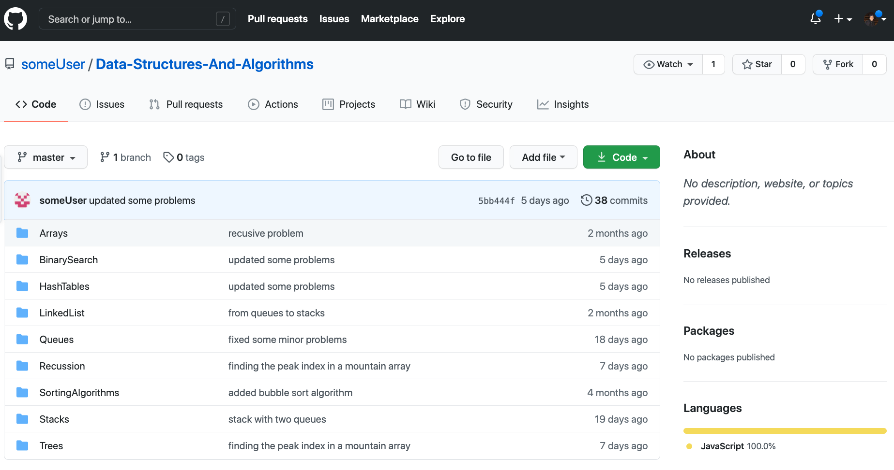

[](https://pursuit.org)

# Getting Reassessed on Pursuit Core Standards
To get reassessed, first identify the standards you are not yet proficient in, by looking at your [Gradebook](https://drive.google.com/drive/search?q=gradebook). Non proficient standards are color coded **red** or **yellow** and their scores are 0 and 1 respectively.

Depending on what type of standards you want to get reassessed first pick between **NON-DSA** and **DSA** standards.

## NON-DSA Standards
To get reassessed on non-DSA Standards complete one of the following projects.

* [TV-Watchlist-App-CTA-retake](https://github.com/Pursuit-Core-6-2/TV-Watchlist-App-CTA-retake). Start from scratch building an app that allows users to keep track of the shows they are watching. This project offers a detailed structure you must follow in terms of the back-end enpoints and front-end pages you need and what they should show/do. Give it your own twist and this can be a great portfolio project.

* [Clone App Project](./projects/clone-app-project/README.md). This project is a bit more free form. There is a list of well-known apps you can build clones/replicas of and a set of functionality you must accomplish. You can architect your backend and frontend in whatever way you want but make sure that it is reasonable. If you have questions reach out to your instructors. Add your twist to it for a unique and interesting project you can talk about in interviews and showcase in your portfolio. Getting as close as possible to the original app is also highly valuable.

💡 If you want to get reassessed on standards that are not formally listed in the project's rubric, demonstrate the chosen standard(s) proficiently in your project and bring it up with your instructors. They will be happy to adjust the rubric if you demonstrate you have mastered a specific standard that might not be in the general project rubric.

## DSA Standards
To get reassessed on DSA Standards first know that the DSA Standards are divided by DSA Topic:

* DSA-1-b: Linked Lists
* DSA-1-d: Hash Tables
* DSA-1-e: Stacks 
* DSA-1-f: Queues
* DSA-1-g: Trees
* DSA-3: Recursion
* DSA-4: Sorting Algorithms
* DSA-5-b: Binary Search

#### How to get reassessed?

1. Set up a new GitHub repo called `Data-Structures-And-Algorithms`
2. Have the following fonder structure for your repo, for each DSA Topic/Standard.
    ```
    Data-Structures-And-Algorithms/
      ├── Binary-Search/
      ├── Hash-Tables/
      ├── Linked-Lists/
      ├── Queues/
      ├── Recursion/
      ├── Sorting-Algorithms/
      ├── Stacks/
      └── Trees/
    ```
3. List and become aware, if you haven't already, of the DSA Standards **you** have low and need to get reassessed in by looking at your [gradebook](https://drive.google.com/drive/search?q=gradebook)
3. For all the DSA standards you need to get reassessed in, review their [lesson](https://github.com/joinpursuit/Pursuit-Core-DSA) as well as explore the resources linked to in the lesson's Readme. Find and explore other resources online to support your understanding of the topic like YouTube videos or its [CTCI](https://www.google.com/search?q=ctci+book) chapter. 
4. Solve at least 3 problems associated for each one of your DSA Standards from the [**Standards Reassessments** Table](https://github.com/joinpursuit/Pursuit-Core-DSA#recommended-problems). Most questions are in LeetCode, solve them there first.
6. Save your solutions in JavaScript files with the name of the problem in the given topic directory and committed to your `Data-Structures-And-Algorithms` repo. For instance, say you solved all the [Trees Problems](https://github.com/joinpursuit/Pursuit-Core-DSA#:~:text=DSA-1-g:%20Trees) then your trees folder should look something like this with each solution in its own file:
    ```
    ...
    └── Trees
        ├── invertBinaryTree.js
        ├── leafSimilarTrees
        ├── maximumDepthBinaryTree.js
        ├── sameTree.js
        └── univaluedBinaryTree.js
    ```
8. Once you have solved the problems covering the standards you need to get reassessed in and feel confident you understand what they are about reach out to one of your instructors and let them know you would like to schedule a DSA Standards Reassessment Debrief. Your instructor will look at the solutions in your repo, ask you questions about your approach and about the given topic/standard in general. Make sure you review your notes and the topics thoroughly.
9. During the debrief, if you demonstrate you understand a given topic by your provided problem solutions and by your answers to the instructor's questions you will be marked proficient or exceptional in them and your grades will update shortly thereafter.

#### At the end your repo should look somewhat like this:


#### :notebook:  Example Repos
Let this repos serve as inspiration for what your `Data-Structures-And-Algorithms` repo can look like

* [msystang/Completed-DSA-Problems](https://github.com/msystang/Completed-DSA-Problems)
* [GorettiRivera/DataStructures-Algorithms-Python](https://github.com/GorettiRivera/DataStructures-Algorithms-Python)

#### 💡 Advice:
* I recommend you try to fit as many standards/topics as possible in one go for a DSA Reassessment Debrief but you can also request a debrief per standard. 
* Reassessing DSA Standards can feel overwhelming, specially if you have to get reassessed in a few of them. Alejo's personal recommendation is to start small. Go for the lowest hanging fruit; pick a topic you think you are most familiar with already or a topic that interests you personally the most, then keep at it for some time reviewing material and practicing on LeetCode or other platforms. Stick with it and you'll see you end up eating it in small bites.
* Solving this problems will make sure you understand the given topic and serve as additional practice for whiteboarding interviews. On top of that this will help you keep your GitHub commits green as you commit.
* Having a **Data Structures and Algorithms** repo pinned in your GitHub and committing often to it can signal to potential employers or recruiters that you know or are at least familiar with these topics already, making you a stronger candidate. Keep adding problems you find in the wild to it and make it your own.

## Misc Standards - Other Projects

* [Responsive Website from mockup](./projects/responsive_site.md). To reassess CSS and HTML related standards only. This can be a good portfolio project to showcase your front-end and css skills.


## Grading
Grading will be done by a member of the instructional team based on the project's associated rubric. Grading might include a 20-40 minute debrief where you get asked questions about your project or asked a whiteboarding question (if reassessing DSA)


