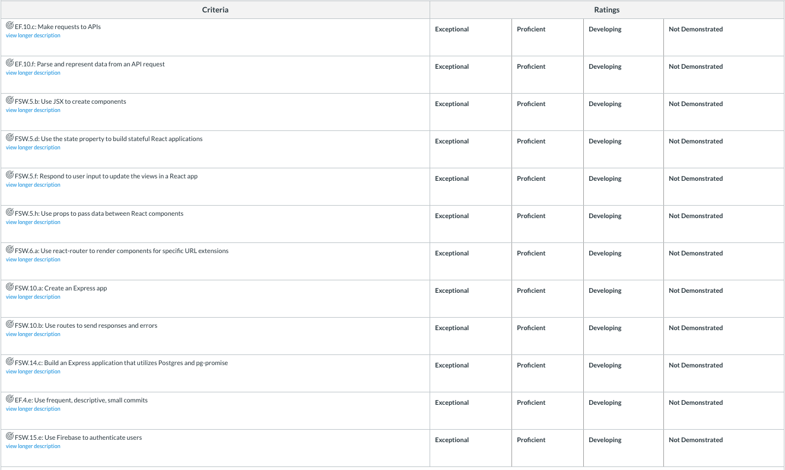

# Clone App Project

Building a whole working app from scratch! 

## Introduction

For this project you'll build an entire web application and deploy it online. This project will go on your portfolio, so you want to spend the time to make it look good as well as function fully.

## Overview

Choose a site from the following list and build a copy of it. Each site has its own unique set of features that you should try to build, which are listed below. All of these sites also have authentication, so assume that "user" means someone who has created an account and logged in.

- Twitter
  - Homepage that shows all tweets
  - User page that shows a user's tweets
  - A form to write new tweets with a 280 character limit
  - A way to search tweets by #hashtags
  - Bonus: add liking tweets / retweet functionality
  - Bonus: Ability to upload a photo with tweet
- Yelp
  - Homepage with a search/listing of categories
  - A search results page
  - A detail page for each business
  - A page where users can leave comments/reviews on a business
  - Bonus: a way for users to create new businesses
  - Bonus: a map to show locations of businesses
- Reddit
  - A homepage that shows posts from each subreddit 
  - Ability to create a new subreddit
  - A way to create a new post in a subreddit
  - Upvote/downvote system for posts
  - Bonus: Photo uploading with posts
  - Bonus: Subscribing to subreddits, which determines what content shows on the homepage
- Facebook
  - Homepage showing a news feed of all posts
  - Profile page showing a single person's posts
  - Ability to write on another user's "wall" (profile page)
  - Liking & sharing functionality 
  - Bonus: Facebook groups, where users can create and join groups, and create posts inside a group
  - Bonus: Photo uploading with posts
- Instagram
  - Homepage showing all posts
  - Ability to create a new post - with photo uploading capabilities 
  - Commenting on posts
  - Bonus: Search by hashtag
  - Bonus: Friending / following feature, which affects what shows on your homepage.

Based on these features, think about what database tables you'll need, and how the responsive layout shows and hides content. Use the actual sites as your inspiration. Inspect their code! See how they lay things out and how they change when you resize the browser. Use the react devtools to look at what their components are.

For all of these sites, you obviously won't be building exact clones. You'll be building sites that have all of the core functionality of the sites you're building

 The list of above features should be included in order for a project to be considered complete. These are the **core features** of each product.

If you want to build another site, run it by your instructor first and they can help you figure out what the minimum features should be.

You do not need to copy the exact styles of a site - you can use them for inspiration, like changing the color scheme. But the layout of your site should be pretty close to what you're copying.

---

## Deliverables

- A working, full-stack web application, deployed on the internet
- Documentation describing the project and how to set it up / run it

## Technical Requirements

1. Your site must use react, firebase, express, and sql. Redux is suggested. Any external libraries are allowed as well if you need them.
1. Your site must be deployed online. Heroku and netlify are ideal.
1. Authentication is required. Any of the above sites wouldn't make sense without authentication anyway.
1. Your project must be documented. See [Writing good readmes](https://github.com/joinpursuit/Pursuit-Core-Web/blob/master/projects/WritingGoodReadmes.md) for a great overview of what should be included in your project readme.

## Submission Guidelines

- Create a new issue on this repository with links to your projects. Make the title of the issue your full name. In the comment include:
  - A link to the code repository/repositories
  - A link to the live site (frontend and API if you built them separately)

## Rubric

